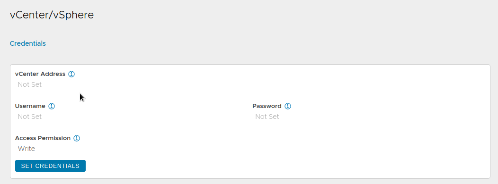
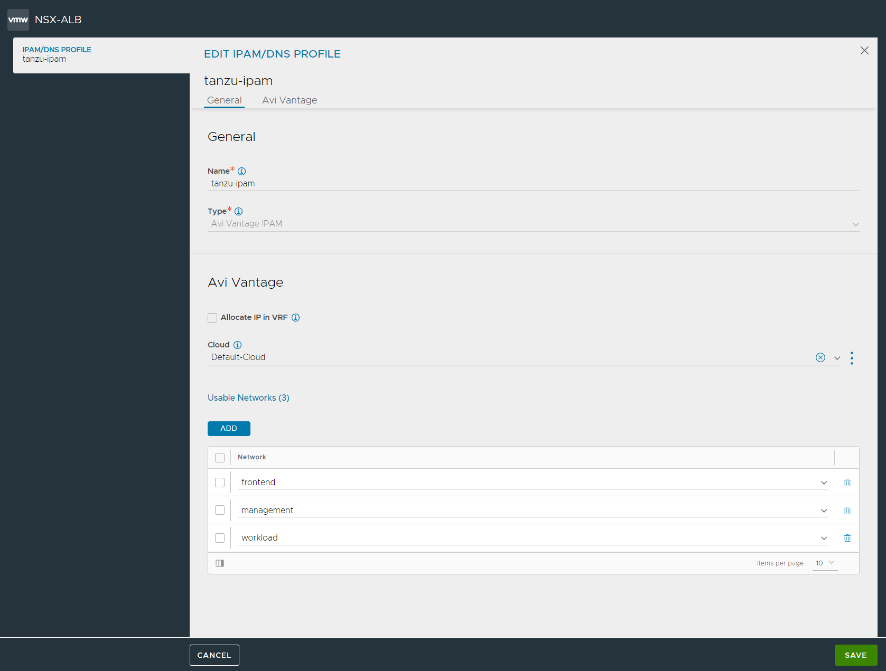

# Install/Configure `VMware NSX Advanced Load Balancer` ( `avi` ) for `tkgm` on `vsphere`

This document describes how to install version `22.1.1` of the `VMware NSX Advanced Load Balancer` ( `avi` ) on `vsphere` and how to configure a `tkgm` ( version `1.6.0` ) cluster ( running on `vsphere` ) to use the `VMware NSX Advanced Load Balancer` ( [VMware NSX Advanced Load Balancer](https://www.vmware.com/products/nsx-advanced-load-balancer.html) ) and deploy a workload ( `nginx` ) using service type `LoadBalancer`.

---

_This is by no means an offical walkthrough and/or ( reference ) documentation and is only intended for experimental installations or workloads. Your mileage will vary. For official documentation see: ( https://docs.vmware.com/en/VMware-NSX-Advanced-Load-Balancer/ and/or https://docs.vmware.com/en/VMware-Tanzu-Kubernetes-Grid/1.5/vmware-tanzu-kubernetes-grid-15/GUID-mgmt-clusters-install-nsx-adv-lb.html )_

---
## Assumptions / Requirements / Prerequisites
- Access to a `vsphere` instance. To setup one, follow [this](../../vsphere) guide.
- A working `tkgm` instance running on `vsphere`. To setup one, follow [this](../../tkgm/vsphere) guide.
- A `customerconnect` account ( https://customerconnect.vmware.com ).
- A network with `dhcp` enabled _and_ a known range of static ip addresses ( on the same network ).
  - In this document we will assume a `192.168.1.0/24` network with `dhcp` enabled for ip addresses `192.168.1.60` and higher. The range below `192.168.1.60` are static ip adresses.
- This document describes the simplest setup, everything in 1 single network, no separate networks and/or vlan's etc.

---
### Step 1
Download the `VMware NSX Advanced Load Balancer` ( `avi` ) controller `ova` file ( https://customerconnect.vmware.com/en/downloads/details?downloadGroup=NSX-ALB-10&productId=988 ( hosted on avi networks portal ) ). This document is based on version `22.1.1` of the controller `.ova` file.

---
### Step 2
To import de ova, open the `vsphere` web client, right-click on the `cluster` and select `Deploy OVF Template` from the menu.


Select the location where to upload the controller ova from.


Go through the wizard and select/configure the resources applicable for your setup.

At the `Customize template` section, populate the `Management Interface IP Address`, `Management Interface Subnet Mask` and the `Default Gateway`.


Review the `Ready to complete` summary and click on `Finish`


After deployment is complete, power-on the VM ( it may take a while before the VM is fully configured and listening on the `ip address` configured as the `Management Interface IP Address` in the  `Customize template` section, of the `.ova` import wizard ).

---
### Step 3
Open a browser and go to the `ip address` configured as the `Management Interface IP Address` in the `Customize template` section, of the `.ova` import wizard in the previous step.

If the deployment completed, the login screen appears where the password for the admin user can be specified.


Next, data like `passphrases`, `dns`, `search domain`, `email` etc can be configured.


---
### Step 4
Create a `self-signed` SSL certificate for the controller.

In the `avi` web console, go to:

`Templates` -> `Security` -> `SSL/TLS Certificates` -> `Create` -> `Controller Certificate`


Next, populate the form to create the new certificate.

*Important:* In the `Subject Alternate Name` field/table, add entries for _both_ `fqdn` _and_ `ip address` of the avi-controller.


---
### Step 5
Configure the controller to use the new certificate

In the `avi` web console, go to:

`Administration` -> `Settings` -> `Access Settings` and click on `Edit` ( the pencil icon )


Under `SSL/TLS Certificate`, remove the `System-Default-Portal-Cert` and `System-Default-Portal-Cert-EC256` certificates and add the created `self-signed` certificate which was created in the previous step.

Click on `Save`

Reload the `avi controller portal` and, in the browser, verify that the `self-signed` certificate, which was created in the previous step, is now served.

---
### Step 6
Configure orchestrator for the `Default-Cloud`.

In the `avi` web console, go to:

`Infrastructure` -> `Clouds`

On the `Default-Cloud` line, select `Convert Cloud Type` ( the gear icon )


And select the orchestrator of your choice ( this document assumes `VMware vCenter/vSphere ESX` )


Confirm the selection.

In the `vCenter/vSphere` section, provided the required data.



Click on `Set Credentials`.


Click on `Connect`.

Uncheck `Use Content Library`.

Click on `Save & Relaunch`.

Select the `Management Network`.

Check `Enable DHCP`.


Click on `Save`.

---
### Step 7
Configure the `Service Engine Group`.

Go to: `Infrastructure` -> `Cloud Resources` -> `Service Engine Group`.

For the `Default-Group` click on `Edit` ( the pencil icon ).


Under `Basic Settings`, set a value for the `Virtual Services per Service Engine` field.

If low on resources, set `Max Number of Service Engines` to `1`.

Under `Advanced`, if needed ( for example, to steer where the `Service Engine`'s are going to be deployed ), set the resources for the `Service Engine`'s to use.


Click on `Save`.

---
### Step 8
Verify the `Service Engine Network`.

Go to: `Infrastructure` -> `Cloud Resources` -> `Networks`.

On the line of the desired network ( the `management` network selected in the previous step(s) ) click on `Edit` ( the pencil icon ).

On the `IP Subnet` line, click on edit ( the pencil icon ).


Click on `Add Static IP Address Pool`.


Click on `Save`.


---
### Step 9
Configure an `IPAM profile`.

Go to: `Templates` -> `Profiles` -> `IPAM/DNS Profiles`

On the `Create` dropdown buttom, select `IPAM Profile`


Enter the requested data



On the `Default-Cloud` associate the `IPAM` profile with the `Default-Cloud`.

`Infrastructure` -> `Clouds` -> `Default-Cloud` ( click on `Edit` ( the pencil icon ) )

Under `IPAM/DNS` select the `IPAM Profile`


---
### Step 10
Apply a license under `Administration` -> `Licensing`.

*The out of the box trail license may not be sufficient for the `Service Engine` VM's to be automatically created. Please apply a proper license before proceeding to the next step.*

---
### Step 11
Configure a `tkgm` cluster to use `avi`.

Take a known good `.yaml` configuration file for both a `Management` cluster as well as a `Workload` cluster which is not using `avi` ( yet ).

Remove the property `VSPHERE_CONTROL_PLANE_ENDPOINT`.

Add the following configuration properties:

- `AVI_CA_DATA_B64`: The `base 64 encoded` certificate data of the self-signed certificate that the portal is serving. Go to `Templates` -> `Security` -> `SSL/TLS Certificates`. Click on the `Export` buttom on the line of the certificate. Copy the certificate part to a temporary file and run `cat cert.txt | base64 -w0`. Paste the output of the command ( one single line ) as value for this property.
- `AVI_CLOUD_NAME`: `Default-Cloud`
- `AVI_CONTROL_PLANE_HA_PROVIDER`: `true`
- `AVI_CONTROLLER`: The `fqdn` or `ip-address` of the `avi-controller`
- `AVI_DATA_NETWORK`: The ( `vsphere` ) network to use ( in the example: `management` )
- `AVI_DATA_NETWORK_CIDR`: In this example: `192.168.1.0/24`
- `AVI_ENABLE`: `true`
- `AVI_MANAGEMENT_CLUSTER_VIP_NETWORK_CIDR`: In this example: `192.168.1.0/24`
- `AVI_MANAGEMENT_CLUSTER_VIP_NETWORK_NAME`: The ( `vsphere` ) network to use ( in the example: `management` )
- `AVI_PASSWORD`: The password of an avi admin account. On a linux box, set environment variable `MK_AVI_PASSWORD`: `export MK_AVI_PASSWORD='myTopSecretPassword'` ( password between single quotes ' ). To get the encrypted value run: ```export MK_AVI_PASSWORD_ENC=`echo -n "$MK_AVI_PASSWORD" | base64 -w0`;echo -e "<encoded:$MK_AVI_PASSWORD_ENC>"```
- `AVI_SERVICE_ENGINE_GROUP`: `Default-Group`
- `AVI_USERNAME`: `admin`

---
### Step 12
Deploy the `management` cluster.

`tanzu management-cluster create --file /path/to/mgmt-avi.yaml -v 9`

After the log line `Start creating management cluster...`, one ( or more, depending on the configuration set in Step 7 ) new `vm`('s) with naming convention `Avi-se-[5-random-chars]` should appear in `vcenter`


In the `avi` console, a `virtual service` appears under `Applications` -> `Dashboard`


In the `avi` console, the `Service Engine` for the `virtual service` appears under `Infrastructure` -> `Cloud Resources` -> `Service Engine`


---
### Step 13
Deploy the `workload` cluster.

Make a copy of the `.yaml` used in the previous step to deploy the management cluster. In the copy, update the `CLUSTER_NAME` property to the name of the workload cluster.

`tanzu cluster create --file /path/to/workload-avi.yaml -v 9`

After creating the workload cluster, in the `avi` console, an additional `virtual service` appears under `Applications` -> `Virtual Services`


---
### Step 14
Deploy a workload using a `LoadBalancer` service.

`kubectl apply -f nginx-deployment.yaml`

`kubectl apply -f nginx-service.yaml`

When running `kubectl get svc -A` check if the `nginx-service` got an `EXTERNAL-IP` from the loadbalancer ( in this case `192.168.1.44` )


After creating the `nginx-service`, in the `avi` console, an additional `virtual service` appears under `Applications` -> `Virtual Services`


---
