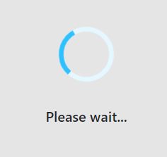

# Install/Configure Tanzu Application Platform `tap` on `eks`

### This document describes how to install/configure `tap` ( [Tanzu Application Platform](https://docs.vmware.com/en/VMware-Tanzu-Application-Platform) ) version `1.0.1` on an `eks` cluster ( and run a demo workload ).

---

_This is by no means an offical walkthrough and/or ( reference ) documentation and is only intended for experimental installations or workloads. Your mileage will vary. For official documentation see: ( https://docs.vmware.com/en/VMware-Tanzu-Application-Platform/ )_

---

### Assumptions / Requirements / Prerequisites
- `tanzunet` account ( https://network.tanzu.vmware.com/ )
- `kubectl` installed
- `aws` cli installed ( https://docs.aws.amazon.com/cli/latest/userguide/getting-started-install.html )

---

### Step 1

Setup/configure `eks` cluster, roles and resources.

Set the following environment variables to onfigure your `aws` credentials.

```

export AWS_ACCESS_KEY_ID=
export AWS_SECRET_ACCESS_KEY=
export AWS_SESSION_TOKEN=
export AWS_REGION=eu-west-1

```

Create the `eks` cluster, roles and resources on `aws` by executing the script below ( this will take approx 15 minutes to complete ).

```
export CLUSTER_NAME=tap-demo

# Create EKS cluster role
export CLUSTER_SERVICE_ROLE=$(aws iam create-role --role-name "${CLUSTER_NAME}-eks-role" --assume-role-policy-document='{"Version":"2012-10-17","Statement":[{"Effect":"Allow","Principal":{"Service":"eks.amazonaws.com"},"Action": "sts:AssumeRole"}]}' --output text --query 'Role.Arn')
aws iam attach-role-policy --role-name "${CLUSTER_NAME}-eks-role" --policy-arn arn:aws:iam::aws:policy/AmazonEKSServicePolicy
aws iam attach-role-policy --role-name "${CLUSTER_NAME}-eks-role" --policy-arn arn:aws:iam::aws:policy/AmazonEKSClusterPolicy

# Create VPC
export STACK_ID=$(aws cloudformation create-stack --stack-name ${CLUSTER_NAME} --template-url https://amazon-eks.s3.us-west-2.amazonaws.com/cloudformation/2020-10-29/amazon-eks-vpc-private-subnets.yaml --output text --query 'StackId')
aws cloudformation wait stack-create-complete --stack-name ${CLUSTER_NAME}
export SECURITY_GROUP=$(aws cloudformation describe-stacks --stack-name ${CLUSTER_NAME} --query "Stacks[0].Outputs[?OutputKey=='SecurityGroups'].OutputValue" --output text)
export SUBNET_IDS=$(aws cloudformation describe-stacks --stack-name ${CLUSTER_NAME} --query "Stacks[0].Outputs[?OutputKey=='SubnetIds'].OutputValue" --output text)

# Create EKS cluster
aws eks create-cluster --name ${CLUSTER_NAME} --kubernetes-version 1.21 --role-arn "${CLUSTER_SERVICE_ROLE}" --resources-vpc-config subnetIds="${SUBNET_IDS}",securityGroupIds="${SECURITY_GROUP}"
aws eks wait cluster-active --name ${CLUSTER_NAME}

# Create EKS worker node role
export WORKER_SERVICE_ROLE=$(aws iam create-role --role-name "${CLUSTER_NAME}-eks-worker-role" --assume-role-policy-document='{"Version":"2012-10-17","Statement":[{"Effect":"Allow","Principal":{"Service":"ec2.amazonaws.com"},"Action": "sts:AssumeRole"}]}' --output text --query 'Role.Arn')
aws iam attach-role-policy --role-name "${CLUSTER_NAME}-eks-worker-role" --policy-arn arn:aws:iam::aws:policy/AmazonEKSWorkerNodePolicy
aws iam attach-role-policy --role-name "${CLUSTER_NAME}-eks-worker-role" --policy-arn arn:aws:iam::aws:policy/AmazonEKS_CNI_Policy
aws iam attach-role-policy --role-name "${CLUSTER_NAME}-eks-worker-role" --policy-arn arn:aws:iam::aws:policy/AmazonEC2ContainerRegistryReadOnly

# Create EKS worker nodes
aws eks create-nodegroup --cluster-name ${CLUSTER_NAME} --kubernetes-version 1.21 --nodegroup-name "${CLUSTER_NAME}-node-group" --disk-size 500 --scaling-config minSize=4,maxSize=4,desiredSize=4 --subnets $(echo $SUBNET_IDS | sed 's/,/ /g') --instance-types t3a.xlarge --node-role ${WORKER_SERVICE_ROLE}
aws eks wait nodegroup-active --cluster-name ${CLUSTER_NAME} --nodegroup-name ${CLUSTER_NAME}-node-group

aws eks update-kubeconfig --name ${CLUSTER_NAME}

```

After completion of the script, check if the context was added to the kube config:

`kubectl config get-contexts`


List which pods are running on the clusters:

`kubectl get pods -A`


---

### Step 2

Create an `ecr` container registry on `aws`. In the `ecr` section of the `aws` console ( https://console.aws.amazon.com/ecr ), click on the `Get started` button.

- Set visibility to `Private`
- Enter a name ( In this document we will assume: `tap/build-service` )
- Click on `Create Repository` to complete the creation.


---

### Step 3

Download and install `tanzu-cluster-essentials-linux-amd64-1.0.0.tgz` ( the variant that matches your operating system ) from ( https://network.tanzu.vmware.com/products/tanzu-cluster-essentials/ ).

Create a temporary directory and extract the `tanzu-cluster-essentials-linux-amd64-1.0.0.tgz` file here.

```
cd ~
mkdir tanzu-cluster-essentials
cd tanzu-cluster-essentials
tar xzf ../tanzu-cluster-essentials-linux-amd64-1.0.0.tgz
```

Set the appropriate environment variables. Make sure the values for `TANZU-NET-USER` and `TANZU-NET-PASSWORD` are both between single quotes `'`.

```
export INSTALL_BUNDLE=registry.tanzu.vmware.com/tanzu-cluster-essentials/cluster-essentials-bundle@sha256:82dfaf70656b54dcba0d4def85ccae1578ff27054e7533d08320244af7fb0343
export INSTALL_REGISTRY_HOSTNAME=registry.tanzu.vmware.com
export INSTALL_REGISTRY_USERNAME=TANZU-NET-USER
export INSTALL_REGISTRY_PASSWORD=TANZU-NET-PASSWORD
```
... and install the cluster essentials.

```
cd $HOME/tanzu-cluster-essentials
./install.sh
```

After completing the install, verify that `kapp-controller` and `secretgen-controller` are installed.

`kubectl get pods -A`


---

### Step 4
Download and install version `v0.11.1` of `tanzu-framework-linux-amd64.tar` ( the variant that matches your operating system ) from ( https://network.tanzu.vmware.com/products/tanzu-application-platform/ )

Create a temporary directory and extract the `tanzu-framework-linux-amd64.tar` file here.

```
cd ~
mkdir tanzu-cli
cd tanzu-cli
tar xf ../tanzu-framework-linux-amd64.tar
```
Set environment variable `TANZU_CLI_NO_INIT` to `true` to assure the local downloaded versions of the CLI core and plug-ins are installed.

`export TANZU_CLI_NO_INIT=true`

Install the CLI core by running by copying `cli/core/v0.11.1/tanzu-core-linux_amd64` to a location in the system path and rename the file to `tanzu`.

`cp tanzu-cli/cli/core/v0.11.1/tanzu-core-linux_amd64 /usr/local/bin/tanzu` ( or any other location in the system path )

Verify that the ( correct version of ) tanzu cli is installed:

`tanzu version`


Verify no cli plugins are installed yet

`tanzu plugin list`


Install the plugins

```
cd tanzu-cli
tanzu plugin install --local cli all
```


Verify the cli plugins are installed ( for `tap` version `1.0.1` it is expected that the `login`, `management-cluster` and `pinniped-auth` plugins have status `not installed` )

`tanzu plugin list`


---

### Step 5

Preparing for installation of `tap`.

Open the `tap-values.yaml` and replace the variables with the values which are applicable to your setup:

- `KP_DEFAULT_REPOSITORY`: The `uri` to the image repository to be used for `build-service` ( the registry that was created in `step 2` ). In the `aws` console, go to the `ecr` section ( https://console.aws.amazon.com/ecr/repositories ) and copy-paste the `uri` of the registry to be used for `build-service`.
- `KP_DEFAULT_REPOSITORY_USERNAME`: The username for the `ecr` repository ( in the case of an `ecr` registry this is usually `AWS` ).
- `KP_DEFAULT_REPOSITORY_PASSWORD`: The password for the user for the `ecr` repository. Run `aws ecr get-login-password --region AWS_REGION` to get the password ( substitute the `AWS_REGION`, `KP_DEFAULT_REPOSITORY_USERNAME` and `REGISTRY_URI` with values applicable for your situation ).
- `TANZU_NET_USERNAME`: The `tanzu-net` username to be used to access https://network.tanzu.vmware.com/ ( between single quotes `'` ).
- `TANZU_NET_PASSWORD`: The password for the `tanzu-net` user ( between single quotes `'` ).
- `KP_DEFAULT_ECR_SERVER`: The server part of the `ecr` registry created in `step 2`. (for example `123456789.dkr.ecr.eu-west-1.amazonaws.com` ( the `uri` without the repository section ) ).
- `KP_DEFAULT_ECR_REPOSITORY`: The repository used for the workloads. In this example we will use `tap`.

---

### Step 6

Installation of `tap`.

If you haven’t already done so, set up environment variables for use during the installation by running:


```
export INSTALL_REGISTRY_USERNAME=TANZU-NET-USER
export INSTALL_REGISTRY_PASSWORD=TANZU-NET-PASSWORD
export INSTALL_REGISTRY_HOSTNAME=registry.tanzu.vmware.com
export TAP_VERSION=VERSION-NUMBER
```

Make sure that:
- `TANZU-NET-USER` and `TANZU-NET-PASSWORD` are both between single quotes `'`
- `VERSION-NUMBER` is your Tanzu Application Platform version. For example, `1.0.1`.

Create a namespace called `tap-install` for deploying any component packages by running:

`kubectl create ns tap-install`

Add the `tap` registry secret

`tanzu secret registry add tap-registry --username ${INSTALL_REGISTRY_USERNAME} --password ${INSTALL_REGISTRY_PASSWORD} --server ${INSTALL_REGISTRY_HOSTNAME} --export-to-all-namespaces --yes --namespace tap-install`

Add the `tap` repository

`tanzu package repository add tanzu-tap-repository --url registry.tanzu.vmware.com/tanzu-application-platform/tap-packages:1.0.1 --namespace tap-install`

Verify the `tap` repository was loaded successfully ( status: `Reconcile succeeded` )

`tanzu package repository get tanzu-tap-repository --namespace tap-install`

List the available packages by running:

`tanzu package available list --namespace tap-install`

List the available `tap` version(s) in this repository:

`tanzu package available list tap.tanzu.vmware.com --namespace tap-install`

---

### Step 7

Install `tap`

`tanzu package install tap -p tap.tanzu.vmware.com -v 1.0.1 --values-file tap-values.yaml -n tap-install`

Wait until installation is finished


Check if all `pods` are in `RUNNING` state

`kubectl get pods -A`

Check if all `apps` are `Reconcile succeeded`

`kubectl get apps -A`

Find the endpoint for the `tap-gui` service

`kubectl get svc -A | grep LoadBalancer`

or ( to directly get the fqdn of the `tap-gui` endpoint )

`kubectl get svc -A | grep LoadBalancer | grep tap-gui | awk '{print $5}'`

Update `tap-values.yaml`, uncomment the entire `app_config` section under the `tap_gui` section and replace the `FQDN_TAP_GUI` with the `fqdn` found in the previous step ( only replace the `fqdn`, *not* the portnumber ).

Update the `tap` installation with the new values:

`tanzu package installed update tap --package-name tap.tanzu.vmware.com --version 1.0.1 -n tap-install -f tap-values.yaml`

After updating `tap`, point your browser to the `fqdn` used in the previous step(s)


Click through the menu items on the left and see if they all show up without error(s).

---
### Step 8

Enable `learning center`.

Find the endpoint for the `envoy` service

`kubectl get svc -A | grep LoadBalancer`

Do an `nslookup` of this `fqdn` and note down the ip address it resolves to.

... or ( to directly `nslookup` the `fqdn` )

`kubectl get svc -A | grep LoadBalancer | grep envoy | grep tanzu-system-ingress | awk '{print $5}' | nslookup | grep -i address | tail -1 | awk '{print $2}'`

Open `tap-values.yaml` and uncomment the section: 

```
#cnrs:
#  domain_name: 34.249.241.129.nip.io

#learningcenter:
#  ingressDomain: .nip.io
```

and enter prefix the `.nip.io` domain with the ip address found in the previous step. For example, if the ip address found in the previous step was `11.22.33.44`, enter:

```
cnrs:
  domain_name: 11.22.33.44.nip.io

learningcenter:
  ingressDomain: 11.22.33.44.nip.io
```

Comment the following section:

```
excluded_packages:
  - learningcenter.tanzu.vmware.com
  - workshops.learningcenter.tanzu.vmware.com
```

like this:

```
#excluded_packages:
#  - learningcenter.tanzu.vmware.com
#  - workshops.learningcenter.tanzu.vmware.com
```

Update the `tap` installation with the new values:

`tanzu package installed update tap --package-name tap.tanzu.vmware.com --version 1.0.1 -n tap-install -f tap-values.yaml`

Use `kubectl get apps -A` to verify that the `learningcenter` and `learningcenter-workshops` apps are `Reconcile succeeded`

Use `kubectl get trainingportal.learningcenter.tanzu.vmware.com` to find the `fqdn` of the `learning-center` ui:


Point your browser to the endpoint:


Click on `Workshop Building Tutorial` to start a workshop

It may take a while ...



... before the workshop ui is ready.


---
### Step 9

Deploy demo workload `tanzu-java-web-app`

*This document will deploy a demo workload using the `ootb_supply_chain_basic` supply chain. The `testing` supply chain ( https://docs.vmware.com/en/Tanzu-Application-Platform/1.0/tap/GUID-scc-install-ootb-sc-wtest.html ) and `testing-and-scanning` supply chain ( https://docs.vmware.com/en/Tanzu-Application-Platform/1.0/tap/GUID-scc-install-ootb-sc-wtest-scan.html ) are _not_ covered in this document.*

Create `dev` namespace

`kubectl create namespace dev`

Apply kubernetes pod security policies (PSPs) to the `dev` namespace.

`kubectl apply -f namespace-rbac-config.yaml -n dev`

For each workload, two repositories need to be added in `ecr` ( this is _only_ applicable for `ecr`, other registries like `harbor`, `docker-hub` etc handle the creation of the workload specific reprositories automatically ).

The two repositories to add need to follow the following namingconvention:
- `tap/[WORKLOAD_NAME]-[NAMESPACE]`
- `tap/[WORKLOAD_NAME]-[NAMESPACE]-bundle`

In this case we are going to deploy a workload called `tanzu-java-web-app`. So, we need to create the following two repositories:
- `tap/tanzu-java-web-app-dev`
- `tap/tanzu-java-web-app-dev-bundle`


Create a secret for the workload to be able to push images to the workload repository ( replace the `docker-server` url and `docker-password` with the values which are applicable for your situation ):

`kubectl create secret docker-registry registry-credentials --docker-server='https://12345678.dkr.ecr.eu-west-1.amazonaws.com' --docker-username='AWS' --docker-password='topSecretPassword' -n dev`

Deploy the demo `tanzu-java-web-app` workload:

`tanzu apps workload create tanzu-java-web-app --git-repo https://github.com/sample-accelerators/tanzu-java-web-app --git-branch main --namespace dev --type web --label app.kubernetes.io/part-of=tanzu-java-web-app --yes`

Use `tanzu apps workload tail tanzu-java-web-app --since 10m --timestamp --namespace dev` to monitor the progress of the build.

Use `kubectl get pods -n dev` to see which pods are created during the different stages of the build. When the build is ready, the ouput should look like this:


Use `tanzu apps workload get tanzu-java-web-app --namespace dev` to get the URL where the worklkoad is deployed ( once the build is finished ).


( The `deployment` pods get terminated automatically ( scale-to-zero ) when there where no requests for a while )

---

### Step 10

Register demo workload `tanzu-java-web-app` in `tap-gui`

On the home screen in the `tap-gui`, click on `Register entity`.

In the `url` field, enter the github url where the `catalog-info.yaml` of the `tanzu-java-web-app` demo workload is located

`https://github.com/sample-accelerators/tanzu-java-web-app/blob/main/catalog/catalog-info.yaml`


Click on `Analyze`


Click on `Import`


On the home screen of `tap-gui` select the imported workload ( under `your organization` ).


Here we see the details of the workload, including a reference to the sourcecode and documentation.


Click on `runtime dependencies` to view/monitor the live resources this workload is using.


---

### Delete tap

`tanzu package installed delete tap -n tap-install`

( don't forget to remove the `aws` resources as well )

---

### Optional

---

### Opt-out telemetry collection

To turn off telemetry collection on your Tanzu Application Platform installation. Ensure your Kubernetes context is pointing to the cluster where Tanzu Application Platform is installed.

`kubectl apply -f opt-out-telemetry.yaml`

---
