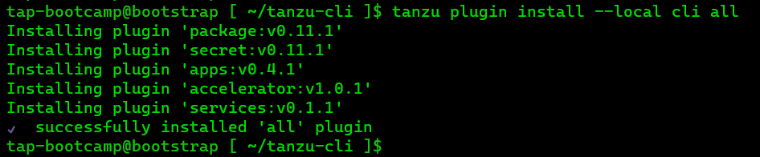
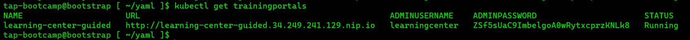
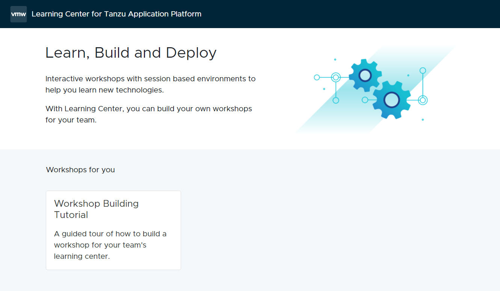
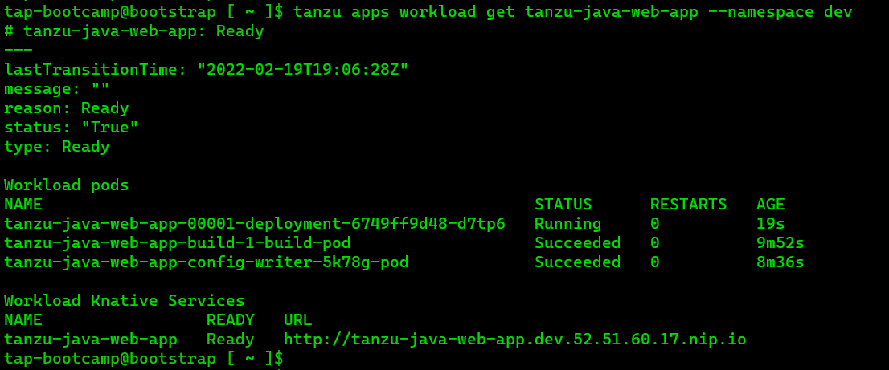
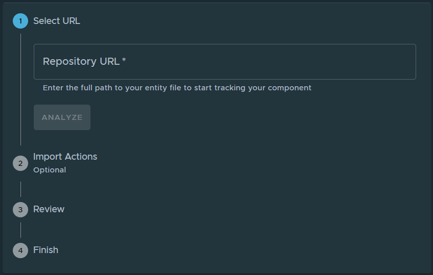

# Install/Configure Tanzu Application Platform `tap` on `minikube`

### This document describes how to install/configure `tap` ( [Tanzu Application Platform](https://docs.vmware.com/en/VMware-Tanzu-Application-Platform) ) version `1.0.1` on a `minikube` cluster ( and run a demo workload ).

---

_This is by no means an offical walkthrough and/or ( reference ) documentation and is only intended for experimental installations or workloads. Your mileage will vary. For official documentation see: ( https://docs.vmware.com/en/VMware-Tanzu-Application-Platform/ )_

---

### Assumptions / Requirements / Prerequisites
- A [VMware Tanzu Network](https://network.tanzu.vmware.com) account ( to download tools and sign EULAs ).
- Access to a `container image registry`, such as [Harbor](https://goharbor.io) or [Docker Hub](https://hub.docker.com) with at least 10 GB of available storage for application images, base images, and runtime dependencies.
- If the `git based repository` and/or `container image registry` are hosted locally ( no SaaS ), make sure there's a `dns` available with a `dns` record for those services ( an entry in the `hosts` file will not work ).
- a vm with minikube installed on it
- kubectl installed

---

### Step 1
Start `minikube` with the following parameters:
- `minikube config set memory 16G`
- `minikube config set cpus 12`
- `minikube config set disk-size 80G`

After `minikube` has started, check if the context was added to the kube config:

`kubectl config get-contexts`


List which pods are running on the clusters:

`kubectl get pods -A`


---

### Step 2

Download and install `tanzu-cluster-essentials-linux-amd64-1.0.0.tgz` ( the variant that matches your operating system ) from ( https://network.tanzu.vmware.com/products/tanzu-cluster-essentials/ ).

Create a temporary directory and extract the `tanzu-cluster-essentials-linux-amd64-1.0.0.tgz` file here.

```
cd ~
mkdir tanzu-cluster-essentials
cd tanzu-cluster-essentials
tar xzf ../tanzu-cluster-essentials-linux-amd64-1.0.0.tgz
```

Set the appropriate environment variables. Make sure the values for `TANZU-NET-USER` and `TANZU-NET-PASSWORD` are both between single quotes `'`.

```
export INSTALL_BUNDLE=registry.tanzu.vmware.com/tanzu-cluster-essentials/cluster-essentials-bundle@sha256:82dfaf70656b54dcba0d4def85ccae1578ff27054e7533d08320244af7fb0343
export INSTALL_REGISTRY_HOSTNAME=registry.tanzu.vmware.com
export INSTALL_REGISTRY_USERNAME=TANZU-NET-USER
export INSTALL_REGISTRY_PASSWORD=TANZU-NET-PASSWORD
```
... and install the cluster essentials.

```
cd $HOME/tanzu-cluster-essentials
./install.sh
```

After completing the install, verify that `kapp-controller` and `secretgen-controller` are installed.

`kubectl get pods -A`


---

### Step 4
Download and install version `v0.11.1` of `tanzu-framework-linux-amd64.tar` ( the variant that matches your operating system ) from ( https://network.tanzu.vmware.com/products/tanzu-application-platform/ )

Create a temporary directory and extract the `tanzu-framework-linux-amd64.tar` file here.

```
cd ~
mkdir tanzu-cli
cd tanzu-cli
tar xf ../tanzu-framework-linux-amd64.tar
```
Set environment variable `TANZU_CLI_NO_INIT` to `true` to assure the local downloaded versions of the CLI core and plug-ins are installed.

`export TANZU_CLI_NO_INIT=true`

Install the CLI core by running by copying `cli/core/v0.11.1/tanzu-core-linux_amd64` to a location in the system path and rename the file to `tanzu`.

`cp tanzu-cli/cli/core/v0.11.1/tanzu-core-linux_amd64 /usr/local/bin/tanzu` ( or any other location in the system path )

Verify that the ( correct version of ) tanzu cli is installed:

`tanzu version`


Verify no cli plugins are installed yet

`tanzu plugin list`


Install the plugins

```
cd tanzu-cli
tanzu plugin install --local cli all
```



Verify the cli plugins are installed ( for `tap` version `1.0.1` it is expected that the `login`, `management-cluster` and `pinniped-auth` plugins have status `not installed` )

`tanzu plugin list`


---

### Step 5

Preparing for installation of `tap`.

Open the `tap-values.yaml` and replace the variables with the values which are applicable to your setup:

- `PROFILE-VALUE`: `full` or `dev-light`
- `KP-DEFAULT-REPO`: is a writable repository in your registry. Tanzu Build Service dependencies are written to this location. For example ( examples of the format for commonly used registries, update values to meet your repository ):
  - Harbor: `my-harbor.io/my-project/build-service`
  - Dockerhub: `my-dockerhub-user/build-service` or `index.docker.io/my-user/build-service`
  - Google Cloud Registry `gcr.io/my-project/build-service`
- `KP-DEFAULT-REPO-USERNAME`: The username that can write to the `KP-DEFAULT-REPO` repository
- `KP-DEFAULT-REPO-PASSWORD`: The password for the user that can write to the `KP-DEFAULT-REPO` repository
- `TANZU-NET-USERNAME`: Your tanzu net username ( https://network.tanzu.vmware.com )
- `TANZU-NET-USERNAME`: Password for your tanzu net user
- `SERVER-NAME`: is the hostname of the registry server ( the nodes on which `tap` is going to be installed needs to be able to resolve this hostname ( check this in particular when using `.local` domains ( add an entry to the `hosts` file on the nodes ) ) ). For example:
  - `Harbor`: my-harbor.io
  - `Dockerhub`: https://index.docker.io/v1/
  - `Google Cloud Registry`: gcr.io
- `REPO-NAME`: The location where the workload images will be stored in the registry. Images will be written to `<SERVER-NAME>/<REPO-NAME>/<workload-name>`. For example:
  - `Harbor`: my-project/supply-chain
  - `Dockerhub`: my-dockerhub-user
  - `Google Cloud Registry`: my-project/supply-chain

---

### Step 6

Installation of `tap`.

If you haven’t already done so, set up environment variables for use during the installation by running:


```
export INSTALL_REGISTRY_USERNAME=TANZU-NET-USER
export INSTALL_REGISTRY_PASSWORD=TANZU-NET-PASSWORD
export INSTALL_REGISTRY_HOSTNAME=registry.tanzu.vmware.com
export TAP_VERSION=VERSION-NUMBER
```

Make sure that:
- `TANZU-NET-USER` and `TANZU-NET-PASSWORD` are both between single quotes `'`
- `VERSION-NUMBER` is your Tanzu Application Platform version. For example, `1.0.1`.

Create a namespace called `tap-install` for deploying any component packages by running:

`kubectl create ns tap-install`

Add the `tap` registry secret

`tanzu secret registry add tap-registry --username ${INSTALL_REGISTRY_USERNAME} --password ${INSTALL_REGISTRY_PASSWORD} --server ${INSTALL_REGISTRY_HOSTNAME} --export-to-all-namespaces --yes --namespace tap-install`

Add the `tap` repository

`tanzu package repository add tanzu-tap-repository --url registry.tanzu.vmware.com/tanzu-application-platform/tap-packages:1.0.1 --namespace tap-install`

Verify the `tap` repository was loaded successfully ( status: `Reconcile succeeded` )

`tanzu package repository get tanzu-tap-repository --namespace tap-install`

List the available packages by running:

`tanzu package available list --namespace tap-install`

List the available `tap` version(s) in this repository:

`tanzu package available list tap.tanzu.vmware.com --namespace tap-install`

---

### Step 7

Install `tap`

`tanzu package install tap -p tap.tanzu.vmware.com -v 1.0.1 --values-file tap-values.yaml -n tap-install`

Wait until installation is finished


Check if all `apps` are `Reconcile succeeded`

`kubectl get apps -A`

Check if all `pods` are in `RUNNING` state

`kubectl get pods -A`

*Assuming that minikube is running on a vm*

To access the `tap-gui` start a port forward on the minikube host.

Find the pod which is running `tap-gui` using `kubectl get pods -A`

Create a tunnel using:

`kubectl port-forward server-5d9c7c458f-5scdt 7000:7000 -n tap-gui`

SSH into the minikube host with a tunnel for port 7000 ( `-L7000:localhost:7000` )

Point the browser on the computer from where you ssh-ed into the minikube host ( with the port 7000 tunnel ) to `http://localhost:7000`


Click through the four menu items on the left and see if they all show up without error(s).

---
### Step 8

Enable `learning center`.

Find the `ip-address` of the `envoy` service

`kubectl get svc -A | grep LoadBalancer`

... or ( to directly get the `ip-address` )

`kubectl get svc -A | grep LoadBalancer | grep envoy | grep tanzu-system-ingress | awk '{print $5}'`

Open `tap-values.yaml` and uncomment the section: 

```
#cnrs:
#  domain_name: 34.249.241.129.nip.io

#learningcenter:
#  ingressDomain: .nip.io
```

and enter prefix the `.nip.io` domain with the ip address found in the previous step. For example, if the ip address found in the previous step was `11.22.33.44`, enter:

```
cnrs:
  domain_name: 11.22.33.44.nip.io

learningcenter:
  ingressDomain: 11.22.33.44.nip.io
```

Comment the following section:

```
excluded_packages:
  - learningcenter.tanzu.vmware.com
  - workshops.learningcenter.tanzu.vmware.com
```

like this:

```
#excluded_packages:
#  - learningcenter.tanzu.vmware.com
#  - workshops.learningcenter.tanzu.vmware.com
```

Update the `tap` installation with the new values:

`tanzu package installed update tap --package-name tap.tanzu.vmware.com --version 1.0.1 -n tap-install -f tap-values.yaml`

Use `kubectl get apps -A` to verify that the `learningcenter` and `learningcenter-workshops` apps are `Reconcile succeeded`

Use `kubectl get trainingportals` to find the `url` of the `learning-center` ui.



NOTE: If the previous command does not return a `url`, gives an error like an `ERROR 500` or `no healthy upstream`, try deleting the `learningcenter-operator` pod in the `learningcenter` namespace.

Point your browser to the endpoint:



Click on `Workshop Building Tutorial` to start a workshop

It may take a while ...


... before the workshop ui is ready.


---
### Step 9

Deploy demo workload `tanzu-java-web-app`

*This document will deploy a demo workload using the `ootb_supply_chain_basic` supply chain. The `testing` supply chain ( https://docs.vmware.com/en/Tanzu-Application-Platform/1.0/tap/GUID-scc-install-ootb-sc-wtest.html ) and `testing-and-scanning` supply chain ( https://docs.vmware.com/en/Tanzu-Application-Platform/1.0/tap/GUID-scc-install-ootb-sc-wtest-scan.html ) are _not_ covered in this document.*

Create `dev` namespace

`kubectl create namespace dev`

Create required `serviceaccount`, `role` and `rolebinding` in the `dev` namespace.

`kubectl apply -f namespace-rbac-config.yaml -n dev`

Create a secret for the workload to be able to push images to the workload repository ( replace the `docker-server` url and `docker-password` with the values which are applicable for your situation ):

`kubectl create secret docker-registry registry-credentials --docker-server='https://fancyregistryname.minikubecr.io' --docker-username='00000000-0000-0000-0000-000000000000' --docker-password='topSecretPassword' -n dev`

Deploy the demo `tanzu-java-web-app` workload:

`tanzu apps workload create tanzu-java-web-app --git-repo https://github.com/sample-accelerators/tanzu-java-web-app --git-branch main --namespace dev --type web --label app.kubernetes.io/part-of=tanzu-java-web-app --yes`

Use `tanzu apps workload tail tanzu-java-web-app --since 10m --timestamp --namespace dev` to monitor the progress of the build.

Use `kubectl get pods -n dev` to see which pods are created during the different stages of the build. When the build is ready, the ouput should look like this:


Use `tanzu apps workload get tanzu-java-web-app --namespace dev` to get the URL where the worklkoad is deployed ( once the build is finished ).



( The `deployment` pods get terminated automatically ( scale-to-zero ) when there where no requests for a while )

---

### Step 10

Register demo workload `tanzu-java-web-app` in `tap-gui`

On the home screen in the `tap-gui`, click on `Register entity`.

In the `url` field, enter the github url where the `catalog-info.yaml` of the `tanzu-java-web-app` demo workload is located

`https://github.com/sample-accelerators/tanzu-java-web-app/blob/main/catalog/catalog-info.yaml`



Click on `Analyze`


Click on `Import`


On the home screen of `tap-gui` select the imported workload ( under `your organization` ).


Here we see the details of the workload, including a reference to the sourcecode and documentation.


Click on `runtime dependencies` to view/monitor the live resources this workload is using.


---

### Delete tap

`tanzu package installed delete tap -n tap-install`

( don't forget to remove the `minikube` resources as well )
