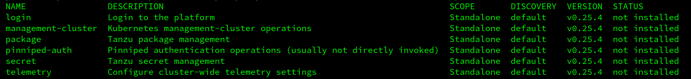
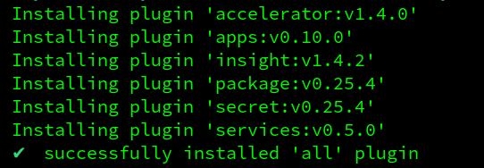
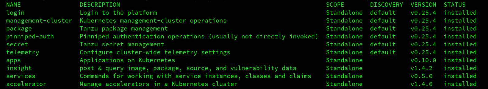
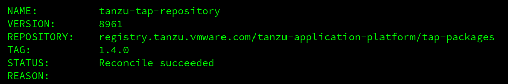
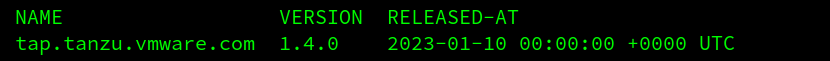
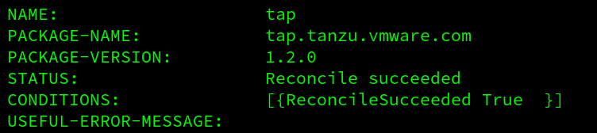

# Install/Configure Tanzu Application Platform `tap` on `tkgm`

### This document describes how to install/configure `tap` ( [Tanzu Application Platform](https://docs.vmware.com/en/VMware-Tanzu-Application-Platform) ) version `1.4.0` ( in a _single_ cluster setup ( for a _multi_ cluster setup, see: https://docs.vmware.com/en/VMware-Tanzu-Application-Platform/1.4/tap/GUID-multicluster-installing-multicluster.html ) ) on a `tkgm` version `1.6.1` cluster ( and run a demo workload ).

---

_This is by no means an offical walkthrough and/or ( reference ) documentation and is only intended for experimental installations or workloads. Your mileage will vary. For official documentation see: ( https://docs.vmware.com/en/VMware-Tanzu-Application-Platform/ )_

---

### Assumptions / Requirements / Prerequisites
- A [VMware Tanzu Network](https://network.tanzu.vmware.com) account ( to download tools and sign EULAs ).
- Access to a `container image registry`, such as [Harbor](https://goharbor.io) or [Docker Hub](https://hub.docker.com) with at least 10 GB of available storage for application images, base images, and runtime dependencies.
- Access to a `git based repository` ( such as: `github`, `gitlab` or `azure devops` ).
- `Kapp Carvel` command line tool v0.37.0 or later ( https://github.com/vmware-tanzu/carvel-kapp/releases ) is installed
- `tilt` ( https://tilt.dev/ ) is installed
- `jq` is installed
- If the `git based repository` and/or `container image registry` are hosted locally ( no SaaS ), make sure there's a `dns` available with a `dns` record for those services ( an entry in the `hosts` file will not work ).
- A `LoadBalancer`. Installing/configuring a `LoadBalancer` service such as, for example, `metallb` or `avi` is _NOT_ part of this guide. If a `LoadBalancer` is not available, a guide on how to install/configure `metallb` is available in `step 5` of this document.

---

### Step 1
_NOTE: This step is only required in case the hosts involved in this `tap` installation use an `https` connection with a self-signed certificate and/or a certificate signed by an unknown CA. For example, but not limited to, a `container image registry` ( on-premise instead of using a Saas service like, for example: `Amazon ECR`, `Azure ACR` or `Docker Hub` ) or a locally hosted `git repository`_

The following steps make sure the `control plane` and `worker nodes` trust the certificate.

_This needs to be done *before* the cluster is created._

- Get the certificate from the private `container image registry`. In the next steps the assumption is that the certificate is capture in a file called `ca.crt`. Getting the certificate can be accomplished using `wget`.

`wget --no-check-certificate https://harbor.tanzu.local/api/v2.0/systeminfo/getcert -O ca.crt`

- Convert the `ca.crt` file from the previous step to a `pem` file

`openssl x509 -in ca.crt -out ca.der -outform DER`

`openssl x509 -in ca.der -inform DER -out tkg-custom-ca.pem -outform PEM`

- Copy the resulting `tkg-custom-ca.pem` to the `ytt` template overlay directory ( the filename `tkg-custom-ca.pem` is important and replace the `infrastructure-vsphere` part of the path with desired target infrastructure )

`cp tkg-custom-ca.pem ~/.config/tanzu/tkg/providers/infrastructure-vsphere/ytt`

- Copy the `ytt` ( https://carvel.dev/ytt ) overlay `overlay-cert-control-plane-and-workers.yaml` to the `ytt` template overlay directory ( the filename `tkg-custom-ca.pem` is important and replace the `infrastructure-vsphere` part of the path in the `cp` command with desired target infrastructure )

`cp overlay-cert-control-plane-and-workers.yaml ~/.config/tanzu/tkg/providers/infrastructure-vsphere/ytt`

( See: https://docs.vmware.com/en/VMware-Tanzu-Kubernetes-Grid/1.5/vmware-tanzu-kubernetes-grid-15/GUID-cluster-lifecycle-secrets.html#custom-ca )

---

### Step 2
_Note: This step is only required in case a `.local` domain is used in the target network and needs to be done *before* the cluster is created._

In modern Linux systems, attempts to resolve hostnames that have a domain suffix that ends in `.local` can fail. This issue occurs because `systemd-networkd`, the DNS resolver in most Linux distributions, attempts to resolve the `.local` domain via multi-cast DNS (mDNS), not via standard DNS servers.

- Copy the `ytt` ( https://carvel.dev/ytt ) overlays `overlay-dns-control-plane.yaml` and `overlay-dns-workers.yaml` to the `ytt` template overlay directory ( replace the `infrastructure-vsphere` part of the path in the `cp` command with desired target infrastructure ).

`cp overlay-dns-control-plane.yaml ~/.config/tanzu/tkg/providers/infrastructure-vsphere/ytt`

`cp overlay-dns-workers.yaml ~/.config/tanzu/tkg/providers/infrastructure-vsphere/ytt`

- Edit _both_ overlay files and update the `nameservers` and `searchDomains` fields to match your network setup. The `dns` server(s) specified in the `nameservers` field should be able to resolve hosts within the `.local` domain ( an entry in the `hosts` file will not work, the `dns` needs to have an entry for those hosts ( for example a git repository or a docker images registry with a `.local` domains name should have a `dns` record in the `dns` server(s) provided in the `nameservers` field ) ).

( See: https://docs.vmware.com/en/VMware-Tanzu-Kubernetes-Grid/1.5/vmware-tanzu-kubernetes-grid-15/GUID-tanzu-k8s-clusters-config-plans.html#resolve-local )

---

### Step 3
Create a plain/empty/vanilla *workload* cluster for `tap` with the following configuration:

- The `control-plane` node:
  - At least `4GB` memory
  - At least `20GB` disk
  - At least `4` cores
- The `worker` node:
  - At least `16GB` memory
  - At least `100GB` disk
  - At least `12` cores ( otherwise some apps and/or pods will fail due to cpu exhaustion )

( See: https://docs.vmware.com/en/Tanzu-Application-Platform/1.0/tap/GUID-prerequisites.html )

`tanzu cluster create --file /path/to/tkg-tap-workload.yaml -v 9`

For more info installing/configuring `tkgm`, click [here](../tkgm).

_Do not install any additional apps/packages/etc on the *workload* cluster yet._

---

### Step 4
If the `docker image registry` and/or the `git based repository` ( See: prerequisites ) are hosted locally, make sure that the `tap` cluster nodes can resolve those locally hosted services using their `fqdn`. Test this by logging on to the `tap` *workload* cluster on all the `control-plane` _and_ `worker` node(s) with `ssh` and `ping` or `nslookup` the `fqdn`'s of the  the `docker image registry` and/or the `git based repository`.

_If_ the `docker image registry` and/or the `git based repository` cannot be resolved from the cluster node ( for example, because they use a `.local` domain name ). Make sure the customisations from `step 2` were applied correctly.

---

### Step 6
Before you can install packages, you have to accept the End User License Agreements (EULAs).

To accept EULAs:
- Sign in to `Tanzu Network` ( https://network.tanzu.vmware.com ).
- For each of the following components, accept or confirm that you have accepted the EULA:
  - Tanzu Application Platform ( https://network.tanzu.vmware.com/products/tanzu-application-platform )
  - Tanzu Build Service and its associated components:
     - Tanzu Build Service Dependencies ( https://network.tanzu.vmware.com/products/tbs-dependencies/ )
     - Buildpacks for VMware Tanzu ( https://network.tanzu.vmware.com/products/tanzu-buildpacks-suite )
     - Stacks for VMware Tanzu ( https://network.tanzu.vmware.com/products/tanzu-stacks-suite )

---

### Step 7
Add/update the `Tanzu Application Platform` specific `Tanzu CLI` plugins.

Sign in to `Tanzu Network` and Navigate to `Tanzu Application Platform` ( https://network.tanzu.vmware.com/products/tanzu-application-platform ). Click the `tanzu-cli-tap-1.4.0` directory and download the CLI bundle corresponding to your operating system. For example, if your client operating system is Linux, download the `tanzu-framework-linux-amd64.tar` bundle.

---

### Step 8
Update the Tanzu CLI to the TAP version of the CLI.
If they exist, delete any CLI files from previous installs by running:

`rm -rf ~/tanzu-cli/cli`

Unpack the `tar` file in the `tanzu` directory by running:

`tar -xvf tanzu-framework-linux-amd64-v0.25.4.1.tar -C ~/tanzu-cli`

Copy the file `~/tanzu-cli/cli/core/v0.25.4/tanzu-core-linux_amd64` to a location in the system path and rename it to `tanzu`.

Check installation status for the core CLI by running:

`tanzu version`


Expected output: version: `v0.25.4`

Navigate to the tanzu directory by running:

`cd $HOME/tanzu-cli`

Set env var `TANZU_CLI_NO_INIT` to `true` to install the local versions of the CLI core and plug-ins you've downloaded:

`export TANZU_CLI_NO_INIT=true`

Verify the current installed plugins

`tanzu plugin list`



Make sure the generic tanzu plugins are properly installed

`tanzu plugin sync`


Verify the installed plugins

`tanzu plugin list`


Add the `tap` plugins ( from the `~/tanzu-cli` dir )

`tanzu plugin install --local cli all`



Verify the `tap` plugins are added

`tanzu plugin list`



---

### Step 9

Create a namespace called `tap-install` for deploying the component packages

`kubectl create ns tap-install`

Create a `secret` for `tap-registry` ( replace `[USERNAME]` and `[PASSWORD]` with the actual credentials for the [VMware Tanzu Network](https://network.tanzu.vmware.com) )

`tanzu secret registry add tap-registry --username '[USERNAME]' --password '[PASSWORD]' --server registry.tanzu.vmware.com --export-to-all-namespaces --yes --namespace tap-install`

Add the `Tanzu Application Platform` package repository to the cluster

`tanzu package repository add tanzu-tap-repository --url registry.tanzu.vmware.com/tanzu-application-platform/tap-packages:1.2.0 --namespace tap-install`

Get the status of the `Tanzu Application Platform` package repository, and ensure the status updates to `Reconcile succeeded`

`tanzu package repository get tanzu-tap-repository --namespace tap-install`



List the available packages

`tanzu package available list --namespace tap-install`

List version information of `tap`

`tanzu package available list tap.tanzu.vmware.com --namespace tap-install`



---

### Step 10
Update the file `tap-values.yaml` to meet your environment:

- `PROFILE-VALUE`: `full` or `dev-light`
- `KP-DEFAULT-REPO`: is a writable repository in your registry. Tanzu Build Service dependencies are written to this location. For example ( examples of the format for commonly used registries, update values to meet your repository ):
  - Harbor: `my-harbor.io/my-project/build-service`
  - Dockerhub: `my-dockerhub-user/build-service` or `index.docker.io/my-user/build-service`
  - Google Cloud Registry `gcr.io/my-project/build-service`
- `KP-DEFAULT-REPO-USERNAME`: The username that can write to the `KP-DEFAULT-REPO` repository
- `KP-DEFAULT-REPO-PASSWORD`: The password for the user that can write to the `KP-DEFAULT-REPO` repository
- `TANZU-NET-USERNAME`: Your tanzu net username ( https://network.tanzu.vmware.com )
- `TANZU-NET-USERNAME`: Password for your tanzu net user
- `SERVER-NAME`: is the hostname of the registry server ( the nodes on which `tap` is going to be installed needs to be able to resolve this hostname ( check this in particular when using `.local` domains ( add an entry to the `hosts` file on the nodes ) ) ). For example:
  - `Harbor`: my-harbor.io
  - `Dockerhub`: https://index.docker.io/v1/
  - `Google Cloud Registry`: gcr.io
- `REPO-NAME`: The location where the workload images will be stored in the registry. Images will be written to `<SERVER-NAME>/<REPO-NAME>/<workload-name>`. For example:
  - `Harbor`: my-project/supply-chain
  - `Dockerhub`: my-dockerhub-user
  - `Google Cloud Registry`: my-project/supply-chain
- `ca_cert_data`: The `b64-encoded` certificate of the `container image registry` ( Only for private repositories ). When using a SaaS based repository the entire `ca_cert_data` section is not needed and can be removed from the file.

*The example/template assumes integration with external services like `okta` and `github`. Please adjust the `tokens`/`secrets`/`etc` accordingly.*
*The example/template configures `tap` for the `ootb_supply_chain_basic`. For information about supply chains and how to configure them, look here ( https://docs.vmware.com/en/Tanzu-Application-Platform/1.0/tap/GUID-getting-started.html#section-3-add-testing-and-security-scanning-to-your-application-13 )*

---

### Step 11
Install `tap`

`tanzu package install tap -p tap.tanzu.vmware.com -v 1.2.0 --values-file tap-values.yaml -n tap-install`

( Even though the field `ceip_policy_disclosed` is set to `true`, there might still be an error stating `The field ceip_policy_disclosed in values.yaml must be set to true in order to proceed with the installation`. Check with the commands below if the deployment started ( in that case error can be ignored ) ).

Check the progress in a separate terminal session using

`watch -n 1 kubectl get pods -A`

and/or

`watch -n 1 kubectl get apps -A`

and/or ( `ReconcileSucceeded True` indicated `tap` was installed succesfully )

`tanzu package installed get tap -n tap-install`



Check if all `pods` are in `RUNNING` state

`kubectl get pods -A`

Check if all `apps` are `Reconcile succeeded`

`kubectl get apps -A`

Find the endpoint for the `tap-gui` service

`kubectl get svc -A | grep LoadBalancer`

or ( to directly get the `ip` of the `tap-gui` endpoint )

`kubectl get svc -A | grep LoadBalancer | grep tap-gui | awk '{print $5}'`

Update `tap-values.yaml`, uncomment the entire `app_config` section under the `tap_gui` section ...

```
#  app_config:
#    app:
#      baseUrl: http://.nip.io:7000
#    backend:
#        baseUrl: http://.nip.io:7000
#        cors:
#          origin: http://.nip.io:7000

```

... and prefix the `.nip.io` domain with the `ip` address found in the previous step. For example, if the ip address found in the previous step was `11.22.33.44`, enter:

```
  app_config:
    app:
      baseUrl: http://11.22.33.44.nip.io:7000
    backend:
        baseUrl: http://11.22.33.44.nip.io:7000
        cors:
          origin: http://11.22.33.44.nip.io:7000

```

Update the `tap` installation with the new values:

`tanzu package installed update tap --package-name tap.tanzu.vmware.com --version 1.2.0 -n tap-install -f tap-values.yaml`

After updating `tap`, point your browser to the `fqdn` used in the previous step(s)


Click through the menu items on the left and see if they all show up without error(s).


---

### Step 12

Point your browser to the `url` which was apecified as `tap_gui` -> `app_config` -> `app` -> `baseUrl`

`tap-gui`


`tap-accelerator` ( in the `tap-gui` ( see url above ) click on `Create` in the menu on the left. If a list of accelerators apprears, this verifies that the connection to the backend is configured properly )


---

### Step 13

Verify that `learning center` is deployed successfully.

Enable `learning center`.

Find the endpoint for the `envoy` service

`kubectl get svc -A | grep LoadBalancer`

... or ( to get the `ip` directly )

`kubectl get svc -A | grep LoadBalancer | grep envoy | grep tanzu-system-ingress | awk '{print $5}'`

Open `tap-values.yaml` and uncomment the section: 

```
#cnrs:
#  domain_name: .nip.io

#learningcenter:
#  ingressDomain: .nip.io
```

... and prefix the `.nip.io` domain with the ip address found in the previous step. For example, if the ip address found in the previous step was `11.22.33.44`, enter:

```
cnrs:
  domain_name: 11.22.33.44.nip.io

learningcenter:
  ingressDomain: 11.22.33.44.nip.io
```

Comment the following section:

```
excluded_packages:
  - learningcenter.tanzu.vmware.com
  - workshops.learningcenter.tanzu.vmware.com
```

like this:

```
#excluded_packages:
#  - learningcenter.tanzu.vmware.com
#  - workshops.learningcenter.tanzu.vmware.com
```

Update the `tap` installation with the new values:

`tanzu package installed update tap --package-name tap.tanzu.vmware.com --version 1.2.0 -n tap-install -f tap-values.yaml`

Use `kubectl get apps -A` to verify that the `learningcenter` and `learningcenter-workshops` apps are `Reconcile succeeded`

Use `kubectl get trainingportal.learningcenter.tanzu.vmware.com` to find the `fqdn` of the `learning-center` ui:


Point your browser to the endpoint:


Click on `Workshop Building Tutorial` to start a workshop

It may take a while ...


... before the workshop ui is ready.


---

### Step 14
To view the `cve scan results` stored in the `metadata store`, a read-only account in the metadata store needs to be created and configured in the `tap-gui`.

Create the service account:

`kubectl apply -f metadata-store-read-only-read-only-service-account.yaml`

Retrieve the read-only access token:

`kubectl get secret $(kubectl get sa -n metadata-store metadata-store-read-client -o json | jq -r '.secrets[0].name') -n metadata-store -o json | jq -r '.data.token' | base64 -d`

Add a `proxy` section under the `tap-gui` -> `app_config` section in the `tap-values.yaml` where the parameter `ACCESS-TOKEN` is replaced by the `read-only access token` retrieved in the previous command.

```
tap_gui:
  app_config:
    proxy:
      /metadata-store:
        target: https://metadata-store-app.metadata-store:8443/api/v1
        changeOrigin: true
        secure: false
        headers:
          Authorization: "Bearer ACCESS-TOKEN"
          X-Custom-Source: project-star
```
Update `tap` to apply the new configuration:

`tanzu package installed update tap --package-name tap.tanzu.vmware.com --version 1.2.0 -n tap-install -f tap-values.yaml`

After the new configuration is applied, open the `tap-gui` and navigate to the `Supply Chains` menu. Select a _succesfully completed_ `source-test-scan-to-url` workload and click on the `Source Scanner` or the `Image Scanner`.


If `cve`'s were found during the scan they will be shown.


( See also: https://docs.vmware.com/en/draft/VMware-Tanzu-Application-Platform/1.2/tap/GUID-tap-gui-plugins-scc-tap-gui.html )

---

### Step 15
Deploy a workload. From the `Tanzu Application Platform GUI` portal, click on `Create` on the left side of the navigation bar to see the list of available accelerators. And choose `Spring PetClinic`.


In the `App Accelerator inputs` prompt, enter the relevant data for the workload.


Review the summary and click on `Create` to generate a `.zip` file with the accelerator code.


Click on `Next` to confirm and generate the `.zip` file.


After downloading the `.zip` file, expand it in a workspace directory and follow your preferred procedure for uploading the generated project files to a Git repository for your new project.

Create a `namespace` for the workload.

`kubectl create namespace development`

Create a secret for the registry.

`tanzu secret registry add registry-credentials --server 'https://index.docker.io/v1/' --username [USERNAME] --password [TOP_SECRET_PASSWORD] --namespace development --export-to-all-namespaces`

Configure `RBAC` for the namespace.

`kubectl -n development apply -f namespace-rbac-config.yaml`

Deploy the workload.

`tanzu apps workload create tanzu-java-web-app --git-repo http://url/to/tanzu-java-web-app.git --git-branch main --namespace development --type web --label app.kubernetes.io/part-of=tanzu-java-web-app --yes`

Progress of the deployment of the workload can be monitored with commands sunch as:

`tanzu apps workload tail tanzu-java-web-app --since 10m --timestamp --namespace development`

or

`kubectl get podintent.conventions.apps.tanzu.vmware.com/tanzu-java-web-app --namespace development -o yaml`

or

`kubectl get image.kpack.io tanzu-java-web-app -o yaml --namespace development`

Deployment is finished when `tanzu apps workload get tanzu-java-web-app --namespace development` returns a url.


Create an entry in a `dns` or `hosts` file for the `url` taken from the command in the output above. Use the `EXTERNAL-IP` from the `LoadBalancer` service ( `192.168.1.26` in the example below ).


When pushing a code commit to the repository, the build and deploy process will automatically trigger again.

---

### Optional

---

### Opt-out telemetry collection

To turn off telemetry collection on your Tanzu Application Platform installation. Ensure your Kubernetes context is pointing to the cluster where Tanzu Application Platform is installed.

`kubectl apply -f opt-out-telemetry.yaml`

---

### Delete tap

`tanzu package installed delete tap -n tap-install`

---
