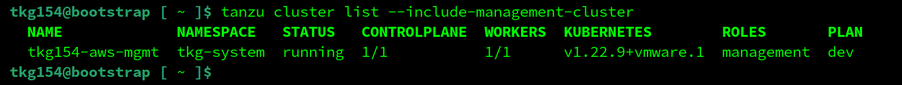
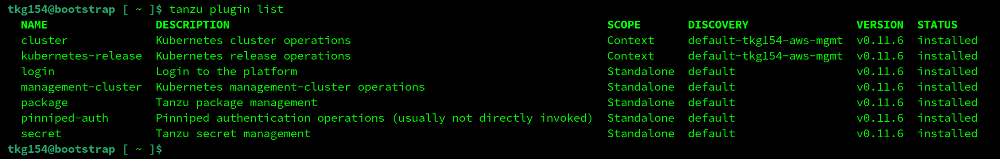
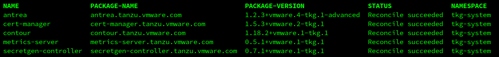
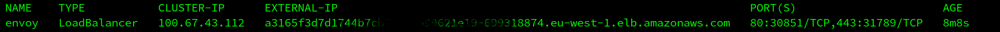
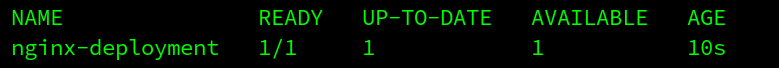

# Install/Configure Tanzu Kubernetes Grid `tkgm` ( standalone / multicloud `tkg` ) version `1.5.4` on `aws`

This document describes how to install/configure `tkgm`, the *standalone / multicloud* variant of `tkg` ( [Tanzu Kubernetes Grid](https://tanzu.vmware.com/kubernetes-grid) ) on `aws`.

---

_This is by no means an offical walkthrough and/or ( reference ) documentation and is only intended for experimental installations or workloads. Your mileage will vary. For official documentation see: ( https://docs.vmware.com/en/VMware-Tanzu-Kubernetes-Grid/ )_

---

### Assumptions / Requirements / Prerequisites
- Access to an `aws` instance with, at least, the permissions described [here](https://docs.vmware.com/en/VMware-Tanzu-Kubernetes-Grid/1.5/vmware-tanzu-kubernetes-grid-15/GUID-mgmt-clusters-aws.html) and associated `access key` and `access key secret`.
- Access to a `linux` based (virtual)machine with, at least, 4GB memory *available* and the following software installed on it:
  - `docker`
  - `aws` cli ( https://docs.aws.amazon.com/cli/latest/userguide/install-cliv2.html )
  - `jq` ( https://stedolan.github.io/jq/download )
  - `kind` ( https://sigs.k8s.io/kind )
- A `customerconnect` account ( to download additional tools ( https://customerconnect.vmware.com ) ).

---

### Step 1
Download the following Tanzu Kubernetes components ( https://my.vmware.com/en/web/vmware/downloads/info/slug/infrastructure_operations_management/vmware_tanzu_kubernetes_grid/1_x )

- VMware Tanzu CLI for Linux ( `tanzu-cli-bundle-linux-amd64.tar` )
- kubectl cluster cli `v1.22.9` for Linux ( `kubectl-linux-v1.22.9+vmware.1.gz` )

---

### Step 2
Copy the downloaded VMware Tanzu CLI for Linux ( `tanzu-cli-bundle-linux-amd64.tar` ) file to the linux based environment with `docker` installed on it.

---

### Step 3
Untar the VMware Tanzu CLI ( `tar xf tanzu-cli-bundle-linux-amd64.tar` )

Copy the VMware Tanzu CLI binary to a location which is in the system path, for example: `/usr/local/bin` ( `cp ~/tanzu-cli/cli/core/v0.11.4/tanzu-core-linux_amd64 /usr/local/bin/tanzu` ).

Make the destination file executable ( `chmod a=rx /usr/local/bin/tanzu` )

---

### Step 4
Copy the downloaded kubectl cluster cli for Linux ( `kubectl-linux-v1.22.9+vmware.1.gz` ) file to the linux based environment with `docker` installed on it.

---

### Step 5
Gunzip the kubectl cluster cli ( `kubectl-linux-v1.22.9+vmware.1.gz` )

Move the extracted file to a location which is in the system path, for example: `/usr/local/bin` ( `mv /path/to/kubectl-linux-v1.22.9+vmware.1 /usr/local/bin/kubectl` ).

Make the destination file executable ( `chmod a=rx /usr/local/bin/kubectl` )

---

### Step 6
Install the `tanzu-cli` plugins.

Verify no plugins have been installed yet.

`tanzu plugin list`

Install the plugins.

`tanzu plugin sync`

Verify the plugins have been installed.

`tanzu plugin list`

---

### Step 7
Set the following environment variables with values that match your `aws` account
- `AWS_ACCESS_KEY_ID`
- `AWS_SECRET_ACCESS_KEY`
- `AWS_SESSION_TOKEN`
- `AWS_REGION`

---

### Step 8
Register an `EC2 Key Pair`. After you have set your AWS account credentials, you must generate an `EC2 key pair` for your AWS account. Tanzu Kubernetes Grid passes the public key part of this key pair to Amazon EC2 in order to authenticate within each region.

For each region that you plan to use with Tanzu Kubernetes Grid, create a named key pair, and output a `.pem` file that includes the name.

For example, the following command uses `tkg` as the keyname, `eu-west-1` for the region and saves the file as `tkg.pem`.

`aws ec2 create-key-pair --key-name tkg --region eu-west-1 --output json | jq .KeyMaterial -r > tkg.pem`

Log in to your Amazon EC2 dashboard and go to `EC2` -> `Network & Security` -> `Key Pairs` to verify that the created key pair is registered with your account.

---

### Step 9
*Before you deploy a management cluster to Amazon EC2 for the first time, you must create a CloudFormation stack for Tanzu Kubernetes Grid.*

This `CloudFormation` stack ( `tkg-cloud-vmware-com` ) includes the identity and access management `IAM` resources that `Tanzu Kubernetes Grid` needs to create and run clusters on `Amazon EC2`.

Make sure the following environment variables are set and contain the correct information:

- `AWS_ACCESS_KEY_ID`
- `AWS_SECRET_ACCESS_KEY`
- `AWS_SESSION_TOKEN`
- `AWS_REGION`

Create the `Cloudformation` stack using the following command ( takes approx. 5 min. to complete ):

`tanzu management-cluster permissions aws set -v 9`

Log in to your Amazon EC2 dashboard and go to `Cloudformation` -> `Stacks` to verify that the `tkg-cloud-vmware-com` stack was created successfully.

---

### Step 10
Open the file `tkg-aws-mgmt-cluster.yaml` and edit the following fields:

- `AWS_ACCESS_KEY_ID`: Output of the following command ( one line ): ``export AWS_ACCESS_KEY_ID_ENC=`echo -n "$AWS_ACCESS_KEY_ID" | base64 -w0`;echo -e "<encoded:$AWS_ACCESS_KEY_ID_ENC>"``
- `AWS_AMI_ID`: For the *ubuntu* based image use: `ami-0c0d6570e43ac145b`. For the *Amazon Linux* based image use: `ami-0092b98bc500b4c18`
- `OS_NAME`: Use `ubuntu` for the *ubuntu* based image or `amazon` for the *Amazon Linux* based image.
- `OS_VERSION`: Use `"20.04"` for the *ubuntu* based image or `"2"` for the *Amazon Linux* based image.
- `AWS_B64ENCODED_CREDENTIALS`: Output of the following command ( one line ): `echo -e "[default]\naws_access_key_id = $AWS_ACCESS_KEY_ID\naws_secret_access_key = $AWS_SECRET_ACCESS_KEY\nregion = $AWS_REGION\n\naws_session_token = $AWS_SESSION_TOKEN\n" | base64 -w0`
- `AWS_NODE_AZ`: In case of no specific requirement, use the value of the `AWS_REGION` parameters followed by character `a`. For example, when `AWS_REGION` is set to `eu-west-1`, the value of the `AWS_NODE_AZ` is `eu-west-1a`.
- `AWS_REGION`: The value of the `AWS_REGION` environment variable 
- `AWS_SECRET_ACCESS_KEY`: Output of the following command ( one line ): ``export AWS_SECRET_ACCESS_KEY_ENC=`echo -n "$AWS_SECRET_ACCESS_KEY" | base64 -w0`;echo -e "<encoded:$AWS_SECRET_ACCESS_KEY_ENC>"``
- `AWS_SESSION_TOKEN`: The value of the `AWS_SESSION_TOKEN` environment variable
- `AWS_SSH_KEY_NAME`: The name of the ssh key which was generated and added to `aws` in step 7
- `CLUSTER_NAME`: The name of the *management* cluster to be created
- `CONTROL_PLANE_MACHINE_TYPE`: In case of no specific requirement, use value `t2.xlarge`
- `NODE_MACHINE_TYPE`: In case of no specific requirement, use value `t2.xlarge`

---

### Step 11
Create the *management* cluster using the following command ( takes approx. 20 min. to complete ):

`tanzu management-cluster create --file /path/to/tkg-aws-mgmt-cluster.yaml -v 9`

During the process various instances, security groups, etc are created. For example, have a look at `EC2` -> `Instances` to see the instances that were created for `bastion`, `control-plane` and `md`.

Use the following command to verify the cluster is up-and-running:

`tanzu cluster list --include-management-cluster`

Check if the `cluster` and `kubernetes-releases` plugins were installed for the `tanzu` cli

`tanzu plugin list`

NOTE:
1) If creation of the *management* cluster fails, make sure you clean up your docker environment *before* the next attempt. For example, using commands like: `kind delete clusters --all` and/or `docker system prune -a` ( *these commands wipe out the entire `kind` clusters and `docker` images/cache/etc. Only execute these commands if you know what you are doing* ).
2) A Tanzu Kubernetes Grid ( `tkgm` ) *management* cluster can also be created using a UI. Running `tanzu management-cluster create --ui`, opens the installer interface locally, at `http://127.0.0.1:8080` in your default browser.

---

### Step 12
To prepare for creating the *workload* cluster, make a copy of `tkg-aws-mgmt-cluster.yaml` used in Step 10 ( this document will assume the filename of the copy is `tkg-aws-workload-cluster.yaml` ) and update the following field:

- `CLUSTER_NAME`: The name of the *workload* cluster to be created

---

### Step 13
Create the *workload* cluster using the following command ( takes approx. 10 min. to complete ):

`tanzu cluster create -f /path/to/tkg-aws-workload-cluster.yaml -v 9`

Use the following command to verify the clusters are up-and-running:

`tanzu cluster list --include-management-cluster`

NOTE:
1) If creation of the *workload* cluster fails, make sure you clean up your docker environment *before* the next attempt. For example, using commands like: `kind delete clusters --all` and/or `docker system prune -a` ( *these commands wipe out the entire `kind` clusters and `docker` images/cache/etc. Only execute these commands if you know what you are doing* ).
2) A Tanzu Kubernetes Grid ( `tkgm` ) *workload* cluster can also be created using a UI. Running `tanzu management-cluster create --ui`, opens the installer interface locally, at `http://127.0.0.1:8080` in your default browser.

---

### Optional

---

### Add the clusters to the kubectl config
In case the newly created clusters were not added to the `.kube/config` ( if the cluster is not in the list shown as output of this command: `kubectl config get-contexts` )

Use the following command to add the desired cluster to the `.kube/config` ( where `[name_of_the_cluster]` is the name of the cluster which can be found using the following command `tanzu cluster list --include-management-cluster` ).

`tanzu cluster kubeconfig get [name_of_the_cluster] --admin`

---

### Install / Configure `cert-manager` in the *workload* cluster

This topic explains how to install Cert Manager into a *workload* cluster ( In *management* clusters, `cert-manager` is installed automatically during cluster creation ).

Confirm that `cert-manager` is available in your *workload* cluster

`tanzu package available list -A`

Retrieve the version of the available `cert-manager` package

`tanzu package available list cert-manager.tanzu.vmware.com -A`

Install `cert-manager` copy/paste the `package-name` and `version` from the output of the commands in the previous steps

`tanzu package install cert-manager --package-name cert-manager.tanzu.vmware.com --version 1.5.3+vmware.2-tkg.1 --namespace tkg-system`

Confirm that `cert-manager` is installed correctly ( status: `Reconcile succeeded` )

`tanzu package installed list -A`

NOTES:
- For debugging purposes, the package can be deleted as follows: `tanzu package installed delete cert-manager --namespace tkg-system`
- To monitor the state, use command like: `kubectl get app/harbor -n [NAMESPACE] -o jsonpath="{.status.usefulErrorMessage}"` or `kubectl get app/harbor -n [NAMESPACE] -o jsonpath="{.status.deploy.stdout}"` or `kubectl get deployment -n [NAMESPACE]` or `kubectl get pods -n [NAMESPACE]`
- For more info, see: https://docs.vmware.com/en/VMware-Tanzu-Kubernetes-Grid/1.5/vmware-tanzu-kubernetes-grid-15/GUID-packages-cert-manager.html

----

### Install / Configure `contour` in the *workload* cluster

`Contour` is a Kubernetes ingress controller that uses the `envoy` edge and service proxy. Tanzu Kubernetes Grid includes signed binaries for `contour` and `envoy`, which you can deploy into Tanzu Kubernetes (workload) clusters to provide ingress control services in those clusters. You deploy `contour` and `envoy` directly into workload clusters. You do not need to deploy `contour` into management clusters.

Copy the file `contour-data-values.yaml` to the linux (virtual)machine from where the `tanzu` commands are executed.

For more info on the content of `contour-data-values.yaml` or how to configure it for other platforms, see: https://docs.vmware.com/en/VMware-Tanzu-Kubernetes-Grid/1.5/vmware-tanzu-kubernetes-grid-15/GUID-packages-ingress-contour.html

Confirm that `contour` is available in your *workload* cluster

`tanzu package available list -A`

Retrieve the version of the available `contour` package

`tanzu package available list contour.tanzu.vmware.com -A`

Install `contour` copy/paste the `package-name` and `version` from the output of the commands in the previous steps

`tanzu package install contour --package-name contour.tanzu.vmware.com --version 1.18.2+vmware.1-tkg.1 --values-file contour-data-values.yaml --namespace tkg-system`

Confirm that `contour` is installed correctly ( status: `Reconcile succeeded` )

`tanzu package installed list -A`

NOTE:
- For debugging purposes, the package can be deleted as follows: `tanzu package installed delete contour --namespace tkg-system`
- To monitor the state, use command like: `kubectl get app/harbor -n [NAMESPACE] -o jsonpath="{.status.usefulErrorMessage}"` or `kubectl get app/harbor -n [NAMESPACE] -o jsonpath="{.status.deploy.stdout}"` or `kubectl get deployment -n [NAMESPACE]` or `kubectl get pods -n [NAMESPACE]`

---

### Install / Configure `harbor` in the *workload* cluster

`Harbor` is a cloud-native container registry that stores, signs, and scans content. `Harbor` extends the open-source Docker distribution by adding the functionalities usually required by users such as security and identity control and management.

*Note: Packages `contour` and `cert-manager` are prerequisites for `harbor`. Make sure the steps for installing `contour` and `cert-manager` were executed prior to installing `harbor`.*

Confirm that the Harbor package is available in the cluster:

`tanzu package available list -A`

Retrieve the version of the available package:

`tanzu package available list harbor.tanzu.vmware.com -A`

Open file `harbor-data-values.yaml` and update the following parameters:
- `harborAdminPassword`
- `secretKey`
- `database.password`
- `core.secret`
- `core.xsrfKey`
- `jobservice.secret`
- `registry.secret`
- `hostname`

Install harbor by executing the following command

`tanzu package install harbor --package-name harbor.tanzu.vmware.com --version 2.3.3+vmware.1-tkg.1 --values-file /path/to/harbor-data-values.yaml --namespace=harbor --create-namespace`

Use `kubectl -n harbor get pods` to monitor if all the `harbor` related pods start up correctly.

When all the pods are running stable, confirm that `harbor` is installed correctly ( status: `Reconcile succeeded` )

`tanzu package installed list -A`

`tanzu package installed get harbor --namespace harbor`

And check all the pods are in `Running` state

`kubectl -n harbor get pods`

Get the `EXTERNAL-IP` of the loadbalancer through which the `harbor` service is reachable

`kubectl get service envoy -n tanzu-system-ingress`

Add the `EXTERNAL-IP` to your `dns` or to the hosts file of your client machine

`51.138.183.74	harbor.tanzu.local`

Point the browser on the client machine to `http://harbor.tanzu.local/`

Also see: https://docs.vmware.com/en/VMware-Tanzu-Kubernetes-Grid/1.5/vmware-tanzu-kubernetes-grid-15/GUID-packages-harbor-registry.html

NOTE:
- For debugging purposes, the package can be deleted as follows: `tanzu package installed delete harbor --namespace [NAMESPACE]`
- To monitor the state, use command like: `kubectl get app/harbor -n [NAMESPACE] -o jsonpath="{.status.usefulErrorMessage}"` or `kubectl get app/harbor -n [NAMESPACE] -o jsonpath="{.status.deploy.stdout}"` or `kubectl get deployment -n [NAMESPACE]` or `kubectl get pods -n [NAMESPACE]`

---

### Deploy `nginx`

Add *workload* cluster to the kubeconfig.

`tanzu cluster kubeconfig get mkennis-vsphere-tkg-workload --admin`

Check if the *workload* cluster was added to the kubeconfig.

`kubectl config get-contexts`

Switch to the *workload* cluster.

`kubectl config use-context mkennis-vsphere-tkg-workload-admin@mkennis-vsphere-tkg-workload`

Copy the following files to the linux (virtual)machine:
- `nginx-deployment.yaml`
- `nginx-service.yaml`

... and execute the following commands:

`kubectl get deployments`

`kubectl apply -f nginx-deployment.yaml`

Confirm that `nginx` deployment was successfully ( `1/1` under `READY` ).

`kubectl get deployments`

`kubectl get services`

`kubectl apply -f nginx-service.yaml`

Confirm that the `nginx-service` service was created successfully ( when there's a `IP` instead of `<pending>` in column `EXTERNAL-IP` ).

`kubectl get services`

Point the browser on the client machine to the `IP` of the service ( it may take a while for the service to respond the first time ).

---

### Delete *management* cluster

Delete the *management* cluster using the following command ( takes approx. 10 min. to complete )

`tanzu management-cluster delete tkg-vsphere-mgmt-cluster -v 9`

---

### Delete *workload* cluster

Delete the *workload* cluster using the following command

`tanzu cluster delete mkennis-vsphere-tkg-workload -v 9`

The command returns the prompt immediately, deletion of the *workload* cluster takes place in the backgroud and can be monitored using 

`tanzu cluster list --include-management-cluster`
