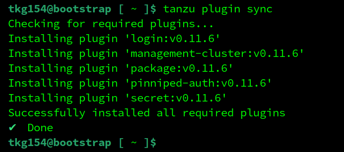
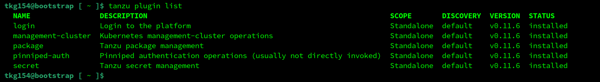
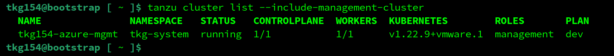
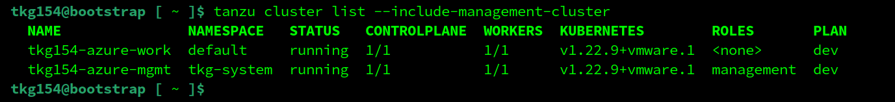
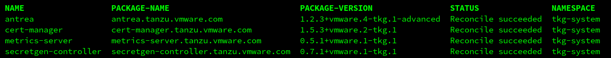
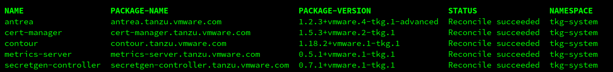
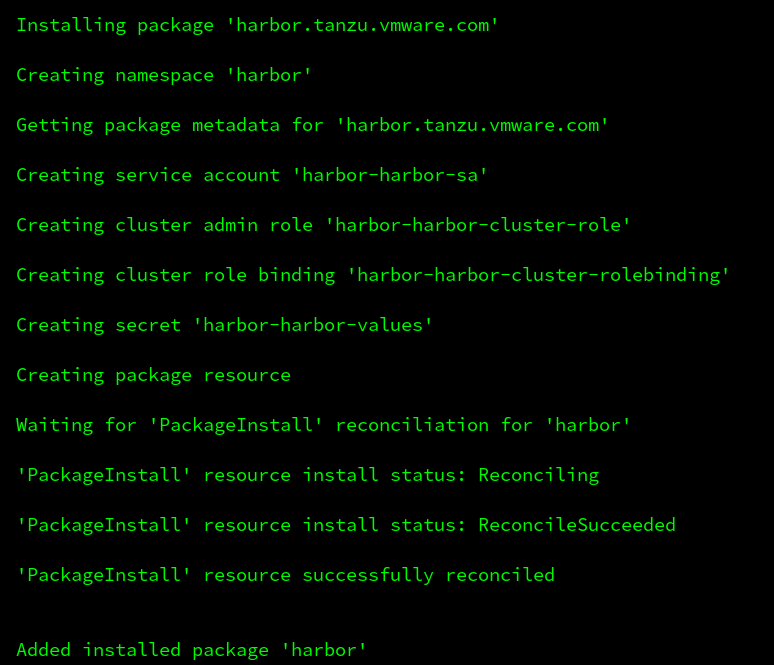
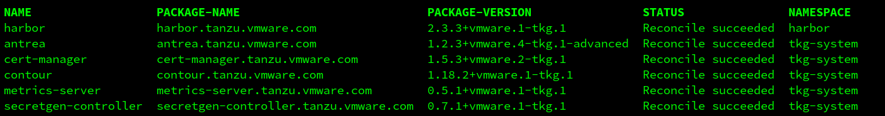
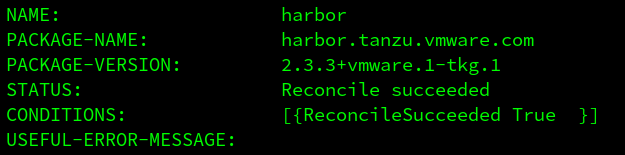
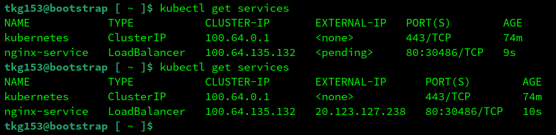

# Install/Configure Tanzu Kubernetes Grid `tkgm` ( standalone / multicloud `tkg` ) version `1.5.4` on `azure`

This document describes how to install/configure `tkgm`, the *standalone / multicloud* variant of `tkg` ( [Tanzu Kubernetes Grid](https://tanzu.vmware.com/kubernetes-grid) ) on `azure`.

---

_This is by no means an offical walkthrough and/or ( reference ) documentation and is only intended for experimental installations or workloads. Your mileage will vary. For official documentation see: ( https://docs.vmware.com/en/VMware-Tanzu-Kubernetes-Grid/ )_

---

### Assumptions / Requirements / Prerequisites
- Access to an `azure` instance with, at least, the permissions described [here](https://docs.vmware.com/en/VMware-Tanzu-Kubernetes-Grid/1.5/vmware-tanzu-kubernetes-grid-15/GUID-mgmt-clusters-azure.html) and associated `Tenant ID`.
- Access to a `linux` based (virtual)machine with, at least, 4GB memory *available* and the following software installed on it:
  - `docker`
  - azure `az` cli ( https://docs.microsoft.com/cli/azure/install-azure-cli )
  - `kind` ( https://sigs.k8s.io/kind )
- A `customerconnect` account ( to download some additional tools ( https://customerconnect.vmware.com ) ).

---

### Step 1
Download the following Tanzu Kubernetes components ( https://my.vmware.com/en/web/vmware/downloads/info/slug/infrastructure_operations_management/vmware_tanzu_kubernetes_grid/1_x )

- VMware Tanzu CLI for Linux ( `tanzu-cli-bundle-linux-amd64.tar` )
- kubectl cluster cli `v1.22.8` for Linux ( `kubectl-linux-v1.22.8+vmware.1.gz` )

---

### Step 2
Copy the downloaded VMware Tanzu CLI for Linux ( `tanzu-cli-bundle-linux-amd64.tar` ) file to the linux based environment with `docker` installed on it.

---

### Step 3
Untar the VMware Tanzu CLI ( `tar xf tanzu-cli-bundle-linux-amd64.tar` ) in an empty directory ( for example `~/tanzu-cli` )

Copy the VMware Tanzu CLI binary to a location which is in the system path, for example: `/usr/local/bin` ( `cp ~/tanzu-cli/cli/core/v0.11.4/tanzu-core-linux_amd64 /usr/local/bin/tanzu` ).

Make the destination file executable ( `chmod a=rx /usr/local/bin/tanzu` )

Check the version of the `tanzu` cli

`tanzu version`

---

### Step 4
Copy the downloaded kubectl cluster cli for Linux ( `kubectl-linux-v1.22.8+vmware.1.gz` ) file to the linux based environment with `docker` installed on it.

---

### Step 5
Gunzip the kubectl cluster cli ( `kubectl-linux-v1.22.8+vmware.1.gz` )

Move the extracted file to a location which is in the system path, for example: `/usr/local/bin` ( `mv /path/to/kubectl-linux-v1.22.8+vmware.1 /usr/local/bin/kubectl` ).

Make the destination file executable ( `chmod a=rx /usr/local/bin/kubectl` )

---

### Step 6
Install the `tanzu-cli` plugins.

Verify no plugins have been installed yet.

`tanzu plugin list`

Install the plugins.

`tanzu plugin sync`

Verify the plugins have been installed.

`tanzu plugin list`

---

### Step 7
Register `Tanzu Kubernetes Grid` as an `Azure Client App`.

Record your `Tenant ID` by opening the Azure portal and navigate to `Azure Active Directory` -> `<Your Azure Org>` -> `Overview`. The value is a GUID, for example: `abcdef01-2345-6789-abcd-ef0123456789`.
                                             
In the `Active Directory` area in the `azure` portal, click `App registrations` -> `New registration`

Enter a display name for the app, for example: `tkg-mkennis` ( other fields can be left empty of their default value ) and click `Register`.

In the overview pane for the app, record its `Application (client) ID` value, which is a GUID.

From the Azure Portal top level, browse to `Subscriptions`. Select the subscription you have access to, and record its `Subscription ID`.

Click on the subscription listing to open its overview pane.

Select `Access control (IAM)` and click `Add role assignment`.

In the `Add role assignment` pane, select the `Contributor` role and click `Next`.

Set the radiobutton `Assign access to` to `User, group, or service principal`.

Under `Members`, click on `Select members` and enter the name of your app, for example: `tkg-mkennis`. It appears under `Selected Members`. Click `Select` Click `Review + assign`.

From the `Azure Portal`, navigate to `Azure Active Directory` -> `App Registrations`, select your tkg app under `Owned applications`.

In the app overview pane click on `Add a certificate or secret` and then `New client secret`.

Enter a `Description` and choose an expiration period. Next, click on `Add`.

Record the secret `Value` and `Secret ID`

---

### Step 8
Verify the `az` cli client, the app definition etc are configured properly using the following command ( replace variables `AZURE_CLIENT_ID`, `AZURE_CLIENT_SECRET` and `AZURE_TENANT_ID` with the actual values collected in the previous step(s) ):

`az login --service-principal --username APP_CLIENT_ID --password AZURE_CLIENT_SECRET --tenant AZURE_TENANT_ID`

The command responds with a `json`.

Next, accept the base image license ( replace variable `AZURE_SUBSCRIPTION_ID` with the actual value collected in the previous step(s). For `PLAN_ID`, use `k8s-1dot22dot9-ubuntu-2004`.

`az vm image terms accept --publisher vmware-inc --offer tkg-capi --plan k8s-1dot22dot9-ubuntu-2004 --subscription AZURE_SUBSCRIPTION_ID`

The command responds with a `json`.

---

### Step 9
In order for the Tanzu CLI to connect to azure from the machine on which you run it, you must provide the public key part of an SSH key pair to Tanzu Kubernetes Grid when you deploy the management cluster. If you do not already have one on the machine on which you run the CLI, you can use a tool such as `ssh-keygen` to generate a key pair.

On the machine on which you will run the Tanzu CLI, run the following `ssh-keygen` command.

`ssh-keygen -t ed25519 -C "email@example.com"`

---

### Step 10
Set the following environment variables:
- `TKG_AZURE_CLIENT_ID`: The value of the `client id` collected in the previous step(s)
- `TKG_AZURE_CLIENT_SECRET`: The value of the `client secret` collected in the previous step(s)

Open the file `tkg-azure-mgmt-cluster.yaml` and edit the following fields:
- `AZURE_CLIENT_ID`: Output of the following command ( one line ): ``export AZURE_CLIENT_ID_ENC=`echo -n "$TKG_AZURE_CLIENT_ID" | base64 -w0`;echo -e "<encoded:$AZURE_CLIENT_ID_ENC>"``
- `AZURE_CLIENT_SECRET`: Output of the following command ( one line ): ``export AZURE_CLIENT_SECRET_ENC=`echo -n "$TKG_AZURE_CLIENT_SECRET" | base64 -w0`;echo -e "<encoded:$AZURE_CLIENT_SECRET_ENC>"``
- `AZURE_CONTROL_PLANE_MACHINE_TYPE`: In case of no specific requirement, use value `Standard_D4s_v4`
- `AZURE_LOCATION`: In case of no specific requirement, use value `westeurope`
- `AZURE_NODE_MACHINE_TYPE`: In case of no specific requirement, use value `Standard_D4s_v4`
- `AZURE_RESOURCE_GROUP`: The resourcegroup for tkg ( will be created if it doesn't exist )
- `AZURE_SSH_PUBLIC_KEY_B64`: Output of the following command ( one line ): `cat /path/to/.ssh/id_rsa.pub | base64 -w0`
- `AZURE_SUBSCRIPTION_ID:`: The value of the `subscription id` collected in the previous step(s)
- `AZURE_TENANT_ID`: The value of the `tenant id` collected in the previous step(s)
- `CLUSTER_NAME`: A friendly name for the *management* cluster to be created. For example: `tkg-azure-mgmt-cluster`
- `OS_VERSION`: The value of the property is `"20.04"`.

*UN*set the following environment variables:
- `TKG_AZURE_CLIENT_ID`
- `TKG_AZURE_CLIENT_SECRET`

---

### Step 11
Create the *management* cluster using the following command ( takes approx. 15 min. to complete ):

`tanzu management-cluster create --file /path/to/tkg-azure-mgmt-cluster.yaml -v 9`

After completion, check if the *management* cluster is deployed correctly.

`tanzu cluster list --include-management-cluster`

Check if the `cluster` and `kubernetes-releases` plugins were installed for the `tanzu` cli

`tanzu plugin list`

NOTE:
1) If creation of the *management* cluster fails, make sure you clean up your docker environment *before* the next attempt. For example, using commands like: `kind delete clusters --all` and/or `docker system prune -a` ( *these commands wipe out the entire `kind` clusters and `docker` images/cache/etc. Only execute these commands if you know what you are doing* ).
2) A Tanzu Kubernetes Grid ( `tkgm` ) *management* cluster can also be created using a UI. Running `tanzu management-cluster create --ui`, opens the installer interface locally, at `http://127.0.0.1:8080` in your default browser.

---

### Step 12
To prepare for creating the *workload* cluster, make a copy of `tkg-azure-mgmt-cluster.yaml` used in `Step 10` ( this document will assume the filename of the copy is `tkg-azure-workload-cluster.yaml` ) and update the following field:

- `CLUSTER_NAME`: The name of the *workload* cluster to be created

---

### Step 13
Create the *workload* cluster using the following command ( takes approx. 10 min. to complete ):

`tanzu cluster create -f /path/to/tkg-azure-workload-cluster.yaml -v 9`

Use the following command to verify the clusters are up-and-running:

`tanzu cluster list --include-management-cluster`

NOTE:
1) If creation of the *workload* cluster fails, make sure you clean up your docker environment *before* the next attempt. For example, using commands like: `kind delete clusters --all` and/or `docker system prune -a` ( *these commands wipe out the entire `kind` clusters and `docker` images/cache/etc. Only execute these commands if you know what you are doing* ).
2) A Tanzu Kubernetes Grid ( `tkgm` ) *workload* cluster can also be created using a UI. Running `tanzu cluster create --ui`, opens the installer interface locally, at `http://127.0.0.1:8080` in your default browser.

---

### Optional

---

### Add the clusters to the kubectl config
In case the newly created clusters were not added to the `.kube/config` ( if the cluster is not in the list shown as output of this command: `kubectl config get-contexts` )

Use the following command to add the desired cluster to the `.kube/config` ( where `[name_of_the_cluster]` is the name of the cluster which can be found using the following command `tanzu cluster list --include-management-cluster` ).

`tanzu cluster kubeconfig get [name_of_the_cluster] --admin`

---

### Install / Configure `cert-manager` in the *workload* cluster

This topic explains how to install Cert Manager into a *workload* cluster ( In *management* clusters, `cert-manager` is installed automatically during cluster creation ).

Confirm that `cert-manager` is available in your *workload* cluster

`tanzu package available list -A`

Retrieve the version of the available `cert-manager` package

`tanzu package available list cert-manager.tanzu.vmware.com -A`

Install `cert-manager` copy/paste the `package-name` and `version` from the output of the commands in the previous steps

`tanzu package install cert-manager --package-name cert-manager.tanzu.vmware.com --version 1.5.3+vmware.2-tkg.1 --namespace tkg-system`

Confirm that `cert-manager` is installed correctly ( status: `Reconcile succeeded` )

`tanzu package installed list -A`

NOTES:
- For debugging purposes, the package can be deleted as follows: `tanzu package installed delete cert-manager --namespace tkg-system`
- To monitor the state, use command like: `kubectl get app/harbor -n [NAMESPACE] -o jsonpath="{.status.usefulErrorMessage}"` or `kubectl get app/harbor -n [NAMESPACE] -o jsonpath="{.status.deploy.stdout}"` or `kubectl get deployment -n [NAMESPACE]` or `kubectl get pods -n [NAMESPACE]`
- For more info, see: https://docs.vmware.com/en/VMware-Tanzu-Kubernetes-Grid/1.5/vmware-tanzu-kubernetes-grid-15/GUID-packages-cert-manager.html

----

### Install / Configure `contour` in the *workload* cluster

`Contour` is a Kubernetes ingress controller that uses the `envoy` edge and service proxy. Tanzu Kubernetes Grid includes signed binaries for `contour` and `envoy`, which you can deploy into Tanzu Kubernetes (workload) clusters to provide ingress control services in those clusters. You deploy `contour` and `envoy` directly into workload clusters. You do not need to deploy `contour` into management clusters.

Copy the file `contour-data-values.yaml` to the linux (virtual)machine from where the `tanzu` commands are executed.

For more info on the content of `contour-data-values.yaml` or how to configure it for other platforms, see: https://docs.vmware.com/en/VMware-Tanzu-Kubernetes-Grid/1.5/vmware-tanzu-kubernetes-grid-15/GUID-packages-ingress-contour.html

Confirm that `contour` is available in your *workload* cluster

`tanzu package available list -A`

Retrieve the version of the available `contour` package

`tanzu package available list contour.tanzu.vmware.com -A`

Install `contour` copy/paste the `package-name` and `version` from the output of the commands in the previous steps

`tanzu package install contour --package-name contour.tanzu.vmware.com --version 1.18.2+vmware.1-tkg.1 --values-file contour-data-values.yaml --namespace tkg-system`

Confirm that `contour` is installed correctly ( status: `Reconcile succeeded` )

`tanzu package installed list -A`

NOTE:
- For debugging purposes, the package can be deleted as follows: `tanzu package installed delete contour --namespace tkg-system`
- To monitor the state, use command like: `kubectl get app/harbor -n [NAMESPACE] -o jsonpath="{.status.usefulErrorMessage}"` or `kubectl get app/harbor -n [NAMESPACE] -o jsonpath="{.status.deploy.stdout}"` or `kubectl get deployment -n [NAMESPACE]` or `kubectl get pods -n [NAMESPACE]`

---

### Install / Configure `harbor` in the *workload* cluster

`Harbor` is a cloud-native container registry that stores, signs, and scans content. `Harbor` extends the open-source Docker distribution by adding the functionalities usually required by users such as security and identity control and management.

*Note: Packages `contour` and `cert-manager` are prerequisites for `harbor`. Make sure the steps for installing `contour` and `cert-manager` were executed prior to installing `harbor`.*

*Note: Make sure that the VM type which is used for the _workload_ cluster supports _Premium Storage_ ( https://docs.microsoft.com/en-us/azure/virtual-machines/premium-storage-performance ) _and_ has sufficient max. number of allowed disks ( See: notes at the end of this chapter )*

Confirm that the Harbor package is available in the cluster:

`tanzu package available list -A`

Retrieve the version of the available package:

`tanzu package available list harbor.tanzu.vmware.com -A`

Open file `harbor-data-values.yaml` and update the following parameters:
- `harborAdminPassword`
- `secretKey`
- `database.password`
- `core.secret`
- `core.xsrfKey`
- `jobservice.secret`
- `registry.secret`
- `hostname`

Install harbor by executing the following command

`tanzu package install harbor --package-name harbor.tanzu.vmware.com --version 2.3.3+vmware.1-tkg.1 --values-file /path/to/harbor-data-values.yaml --namespace=harbor --create-namespace`

Use `kubectl -n harbor get pods` to monitor if all the `harbor` related pods start up correctly.

When all the pods are running stable, confirm that `harbor` is installed correctly ( status: `Reconcile succeeded` )

`tanzu package installed list -A`

`tanzu package installed get harbor --namespace harbor`

And check all the pods are in `Running` state

`kubectl -n harbor get pods`

Get the `EXTERNAL-IP` of the loadbalancer through which the `harbor` service is reachable

`kubectl get service envoy -n tanzu-system-ingress`

Add the `EXTERNAL-IP` to your `dns` or to the hosts file of your client machine

`51.138.183.74	harbor.tanzu.local`

Point the browser on the client machine to `http://harbor.tanzu.local/`

Also see: https://docs.vmware.com/en/VMware-Tanzu-Kubernetes-Grid/1.5/vmware-tanzu-kubernetes-grid-15/GUID-packages-harbor-registry.html

NOTE:
- When pods remain in `Pending` state ( `kubectl get pods -n harbor` ), do a describe of the `Pending` pod ( in this example the pod is `harbor-trivy-0` but it can be any pod in the `harbor` namespace ) using `kubectl describe harbor-trivy-0 -n harbor`. If there are messages like `0/2 nodes are available: 1 node(s) exceed max volume count, 1 node(s) had taint {node-role.kubernetes.io/master: }, that the pod didn't tolerate.`, the VM chosen for the cluster nodes _probably_ doesn't have enough `Max data disks` ( for example, a `Standard_D2s_v3` allows a max. of `4` data disks ( See: https://docs.microsoft.com/en-us/azure/virtual-machines/dv3-dsv3-series#dsv3-series ). Choose a larger VM to allow more data disks ( see: https://docs.microsoft.com/en-us/azure/virtual-machines/ ). For example, a `Standard_D4s_v4` which allows `16` data disks appears to be working pretty well with `harbor`. Make sure that the VM type supports _Premium Storage_ ( https://docs.microsoft.com/en-us/azure/virtual-machines/premium-storage-performance )
- For debugging purposes, the package can be deleted as follows: `tanzu package installed delete harbor --namespace [NAMESPACE]`
- To monitor the state, use command like: `kubectl get app/harbor -n [NAMESPACE] -o jsonpath="{.status.usefulErrorMessage}"` or `kubectl get app/harbor -n [NAMESPACE] -o jsonpath="{.status.deploy.stdout}"` or `kubectl get deployment -n [NAMESPACE]` or `kubectl get pods -n [NAMESPACE]`

---

### Deploy `nginx`

Add *workload* cluster to the kubeconfig.

`tanzu cluster kubeconfig get mkennis-azure-tkg-workload --admin`

Check if the *workload* cluster was added to the kubeconfig.

`kubectl config get-contexts`

Switch to the *workload* cluster.

`kubectl config use-context mkennis-azure-tkg-workload-admin@mkennis-azure-tkg-workload`

Copy the following files to the linux (virtual)machine:
- `nginx-deployment.yaml`
- `nginx-service.yaml`

... and execute the following commands:

`kubectl get deployments`

`kubectl apply -f nginx-deployment.yaml`

Confirm that `nginx` deployment was successfully ( `1/1` under `READY` ).

`kubectl get deployments`

`kubectl get services`

`kubectl apply -f nginx-service.yaml`

Confirm that the `nginx-service` service was created successfully ( when there's a `IP` instead of `<pending>` in column `EXTERNAL-IP` ).

`kubectl get services`

Point the browser on the client machine to the `IP` of the service ( it may take a while for the service to respond the first time ).

NOTE: In the `azure` console under `network security groups` there are two `nsg`'s created per management/workload cluster ( a node-`nsg` and a controlplane-`nsg` ). After deploying a `service` of type `LoadBalancer`, automatically an entry in the node-`nsg` for the `workload` cluster is created to expose the service to the internet.

Also see: https://docs.vmware.com/en/VMware-Tanzu-Kubernetes-Grid/

---

### Delete *management* cluster

Delete the *management* cluster using the following command ( takes approx. 10 min. to complete )

`tanzu management-cluster delete tkg-azure-mgmt-cluster -v 9`

---

### Delete *workload* cluster

Delete the *workload* cluster using the following command

`tanzu cluster delete mkennis-azure-tkg-workload -v 9`

The command returns the prompt immediately, deletion of the *workload* cluster takes place in the backgroud and can be monitored using 

`tanzu cluster list --include-management-cluster`
