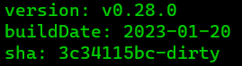
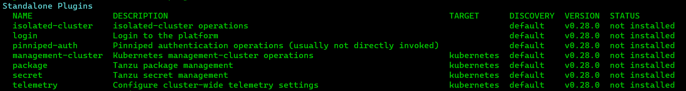
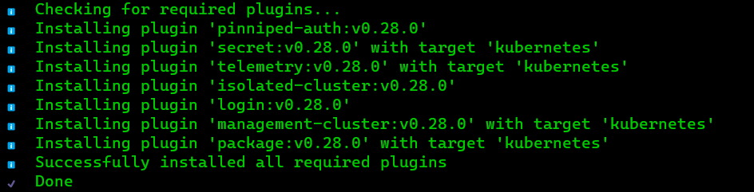
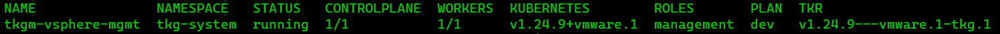
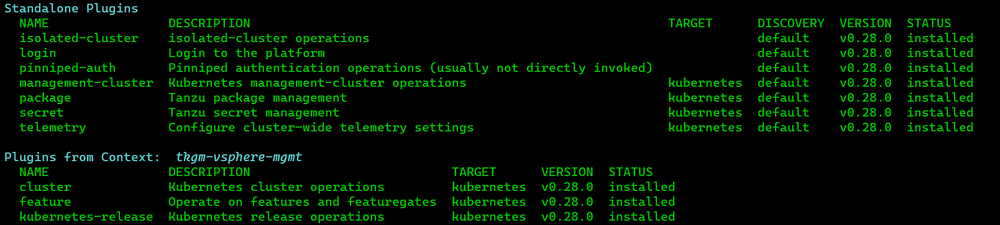
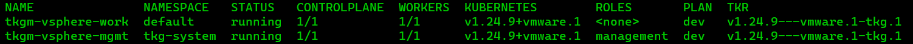
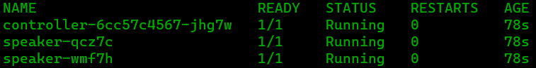
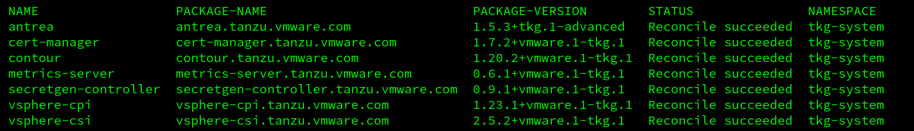
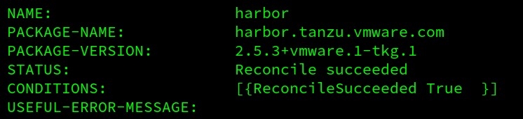

# Install/Configure Tanzu Kubernetes Grid `tkgm` ( standalone / multicloud `tkg` ) version `1.6.1` on `vsphere 8`

This document describes how to install/configure the *standalone / multicloud* variant of `tkg` ( [Tanzu Kubernetes Grid](https://tanzu.vmware.com/kubernetes-grid) ) on `vsphere 8`.

NOTE: If you are looking for instructions on how to enable/configure `tkgs`, which is the `tkg` variant which is *embedded* in `vsphere 8` ( also known as `workload management` ), click [here](../../tkgs).

---

_This is by no means an offical walkthrough and/or ( reference ) documentation and is only intended for experimental installations or workloads. Your mileage will vary. For official documentation see: ( https://docs.vmware.com/en/VMware-Tanzu-Kubernetes-Grid/ )_

---

### Assumptions / Requirements / Prerequisites
- Access to a `vsphere` instance. To setup one, follow [this](../../vsphere) guide.
- Access to a `linux` based (virtual)machine with, at least, 6GB memory *available* ( as-in *available* not *total* ) and the following software installed on it:
  - `docker`
  - `kind` ( https://sigs.k8s.io/kind )
- At least 2 static `ip address` are required from your local LAN network ( 1 for each mgmt cluster management node and 1 for each workload cluster management node ).
- A `customerconnect` account ( to download some additional tools ( https://customerconnect.vmware.com ) ).

---

### Step 1
Download the following Tanzu Kubernetes components ( https://my.vmware.com/en/web/vmware/downloads/info/slug/infrastructure_operations_management/vmware_tanzu_kubernetes_grid/1_x )

- VMware Tanzu CLI for Linux ( `tanzu-cli-bundle-linux-amd64.tar.gz` )
- Photon v3 Kubernetes `v1.23.8` OVA ( `photon-3-kube-v1.23.8+vmware.2-tkg.2-81d1a7892ad39f017fbaf59f9907cbe7.ova` )
- Ubuntu 2004 Kubernetes `v1.23.8` OVA ( `ubuntu-2004-kube-v1.23.8+vmware.2-tkg.1-85a434f93857371fccb566a414462981.ova` )
- kubectl cluster cli `v1.23.8` for Linux ( `kubectl-linux-v1.23.8+vmware.2.gz` )

---

### Step 2
Import the kubernetes base image(s) template into `vsphere`.

- In the `vsphere` Client, go to `Inventory`, right-click on `Tanzu-Datacenter` and select `Deploy OVF template`.
- Select `Local file`, click the button to upload files, and navigate to the downloaded OVA file on your local machine ( `photon-3-kube-v1.23.8+vmware.2-tkg.2-81d1a7892ad39f017fbaf59f9907cbe7.ova` and/or `ubuntu-2004-kube-v1.23.8+vmware.2-tkg.1-85a434f93857371fccb566a414462981.ova` ).
- Step through the wizard accepting all the defaults for `Name and folder`, `Compute resource`, `Review details` and accept the `license agreement`.
- At `Select storage`, make sure to select the correct `datastore` and set `Select virtual disk format` to `Thin Provision`.
- At `Select networks`, select the destination network `Management`.
- Review the summary and click `Finish` to complete.

*NOTE: Do not power on the VM*

When the OVA deployment finishes, right-click the VM ( `photon-3-kube-v1.23.8+vmware.2` and/or `ubuntu-2004-kube-v1.23.8+vmware.2` ) and select `Template` -> `Convert to Template`.

---

### Step 3 ( Step can be skipped if Administrator user is used )
In the `vsphere` Client, go to `Administration` -> `Access Control` -> `Roles`, and create a new role, for example `TKG`, with the following permissions.

| `vsphere` Object | Required Permission |
| --- |--- |
| Cns | Searchable |
| Datastore | Allocate space Browse datastore Low level file operations |
| Network | Assign network |
| Profile-driven storage | Profile-driven storage view |
| Resource | Assign virtual machine to resource pool |
| Sessions | Message Validate session |
| Virtual machine | Change Configuration -> Add existing disk Change Configuration -> Add new disk Change Configuration -> Add or remove device Change Configuration -> Advanced configuration Change Configuration -> Change CPU count Change Configuration -> Change Memory Change Configuration -> Change Settings Change Configuration -> Configure Raw device Change Configuration -> Extend virtual disk Change Configuration -> Modify device settings Change Configuration -> Remove disk Edit Inventory -> Create from existing Edit Inventory -> Remove Interaction -> Power On Interaction -> Power Off |
| vApp | Import |

NOTE: If you are deploying Tanzu Kubernetes clusters to a `vsphere 8` instance  with `workload management` enabled, you must also set the `Global` -> `Cloud Admin` permission.

---

### Step 4 ( Step can be skipped if Administrator user is used )
In `Administration` -> `Single Sign On` -> `Users and Groups`, create a new user account in the appropriate domain ( `vsphere.local` ), for example `tkg-user`.

---

### Step 5 ( Step can be skipped if Administrator user is used )
In the following views, right-click the objects that your Tanzu Kubernetes Grid deployment will use, select `Add Permission`, and assign the `tkg-user` with the `TKG` role to each object.

In the `Hosts and Clusters` view:
- The root vCenter Server object
- The Datacenter and all of the Host and Cluster folders, from the Datacenter object down to the cluster that manages the Tanzu Kubernetes Grid deployment
- Target hosts and clusters
- Target resource pools, with `propagate to children` enabled

In the `VMs and Templates` view:
- The deployed Tanzu Kubernetes Grid base image templates
- Target VM and Template folders, with `propagate to children` enabled

In the `Storage` view:
- Datastores and all storage folders, from the Datacenter object down to the datastores that will be used for Tanzu Kubernetes Grid deployments

In the `Networking` view:
- Networks or distributed port groups to which clusters will be assigned
- Distributed switches ( if exist )

---

### Step 6
Copy the downloaded VMware Tanzu CLI for Linux ( `tanzu-cli-bundle-linux-amd64.tar.gz` ) file to the linux based environment with `docker` installed on it.

---

### Step 7
Untar the VMware Tanzu CLI ( `tar xzf tanzu-cli-bundle-linux-amd64.tar.gz` ) in an empty directory ( for example `~/tanzu-cli` )

Copy the VMware Tanzu CLI binary to a location which is in the system path, for example: `/usr/local/bin` ( `cp ~/tanzu-cli/cli/core/v0.25.0/tanzu-core-linux_amd64 /usr/local/bin/tanzu` ).

Make the destination file executable ( `chmod a=rx /usr/local/bin/tanzu` )

Check the version of the `tanzu` cli

`tanzu version`

---

### Step 8
Copy the downloaded kubectl cluster cli for Linux ( `kubectl-linux-v1.23.8+vmware.2.gz` ) file to the linux based environment with `docker` installed on it.

---

### Step 9
`gunzip` the kubectl cluster cli ( `kubectl-linux-v1.23.8+vmware.2.gz` )

Move the extracted file to a location which is in the system path, for example: `/usr/local/bin` ( `mv /path/to/kubectl-linux-v1.23.8+vmware.2 /usr/local/bin/kubectl` ).

Make the destination file executable ( `chmod a=rx /usr/local/bin/kubectl` )

---

### Step 10
Install the `tanzu-cli` plugins.

Verify no plugins have been installed yet.

`tanzu plugin list`

Install the plugins.

`tanzu plugin sync`

Verify the plugins have been installed.

`tanzu plugin list`

---

### Step 11
In order for the Tanzu CLI to connect to `vsphere` from the machine on which you run it, you must provide the public key part of an SSH key pair to Tanzu Kubernetes Grid when you deploy the management cluster. If you do not already have one on the machine on which you run the CLI, you can use a tool such as `ssh-keygen` to generate a key pair.

On the machine on which you will run the Tanzu CLI, run the following `ssh-keygen` command.

`ssh-keygen -t ed25519 -C "email@example.com"`

---

### Step 12
Preparing deployment of *management* cluster.

Open `mgmt-cluster-vpshere-local.yaml` and update the values of the keys to refect your setup.

In particular, the values of the following keys:
- `CLUSTER_NAME`: The name of the *management* cluster. For example: `tkg-management-vsphere-local`
- `VSPHERE_SSH_AUTHORIZED_KEY`: The public key of the keypair generated in the previous step ( including the `ssh-ed25519` ( or `ssh-rsa` ) at the beginning and the email address at the end ).
- `VSPHERE_TLS_THUMBPRINT`: The thumbprint of the `vsphere` SSL certificate. This can be obtained, for example, by running `openssl x509 -in /etc/vmware-vpx/ssl/rui.crt -fingerprint -sha1 -noout | cut -d'=' -f2` on an `ssh` shell on the `vcsa` host *or* copy from browser ( click on `certificate information` -> `details` -> `thumbprint` ( paste thumbprint in caps and a `:` after every second character ( `AA:BB:CC` etc ) ) )
- `OS_NAME`: Depends on which base image was imported in step 2. Use `ubuntu` for the *ubuntu* based image or `photon` for the *photon* based image.
- `OS_VERSION`: Depends on which base image was imported in step 2. Use `"20.04"` for the *ubuntu* based image or `"3"` for the *photon* based image.
- `VSPHERE_CONTROL_PLANE_ENDPOINT`: The static `ip address` on which the `*management cluster* control plane` will be running ( must be a static `ip address` which is on the same network as the DHCP server but make sure there's no overlap in DHCP range )
- `VSPHERE_NETWORK`: Set to the `Management` network
- `VSPHERE_SERVER`: The `ip address` of the `vsphere` server ( `fqdn` does not always seem to work, preferably enter the `ip address` here )
- `VSPHERE_PASSWORD`: The password of a `vsphere` adminstrator account. On a linux box, set environment variable `MK_VSPHERE_PASSWORD`: `export MK_VSPHERE_PASSWORD=myTopSecretPassword` ( password between single quotes `'` ). To get the encrypted value run: ``export MK_VSPHERE_PASSWORD_ENC=`echo -n "$MK_VSPHERE_PASSWORD" | base64 -w0`;echo -e "<encoded:$MK_VSPHERE_PASSWORD_ENC>"``

---

### Step 13
Deployment of *management* cluster.

On the linux (virtual)machine where the `tanzu CLI` and `docker` are installed run: `export DEPLOY_TKG_ON_VSPHERE7=true`

Create the *management* cluster by running the following command ( takes approx 15 mins to complete ):

`tanzu management-cluster create --file /path/to/mgmt-cluster-vpshere-local.yaml -v 9` 

After completion, check if the *management* cluster is deployed correctly.

`tanzu cluster list --include-management-cluster`

Check if the `cluster` and `kubernetes-releases` plugins were installed for the `tanzu` cli

`tanzu plugin list`

NOTE:
1) If creation of the *management* cluster fails, make sure you clean up your docker environment *before* the next attempt. For example, using commands like: `kind delete clusters --all` and/or `docker system prune -a` ( *these commands wipe out the entire `kind` clusters and `docker` images/cache/etc. Only execute these commands if you know what you are doing* ).
2) A Tanzu Kubernetes Grid ( `tkgm` ) *management* cluster can also be created using a UI. Running `tanzu management-cluster create --ui`, opens the installer interface locally, at `http://127.0.0.1:8080` in your default browser.

---

### Step 14
Preparing deployment of *workload* cluster. Make a copy of the yaml that was used for creating the management cluster ( `cp mgmt-cluster-vpshere-local.yaml workload-cluster-vpshere-local.yaml` ).

Open `workload-cluster-vpshere-local.yaml` and update the following keys to refect your setup:
- `CLUSTER_NAME`: The name of the *workload* cluster. For example: `tkg-workload-vsphere-local`
- `VSPHERE_CONTROL_PLANE_ENDPOINT`: The static `ip address` on which the `*workload cluster* control plane` will be running ( must be a static `ip address` which is on the same network as the DHCP server but make sure there's no overlap in DHCP range )
- `VSPHERE_NETWORK`: Set to the `Workload` network ( if applicable/available )

---

### Step 15
Create the *workload* cluster by running the following command: `tanzu cluster create --file /path/to/workload-cluster-vpshere-local.yaml -v 9` ( takes approx 10 mins to complete )

After completion, check if the *workload* cluster is deployed correctly.

`tanzu cluster list --include-management-cluster`

The cluster node's VM's in `vsphere`

NOTE:
1) If creation of the *workload* cluster fails, make sure you clean up your docker environment *before* the next attempt. For example, using commands like: `kind delete clusters --all` and/or `docker system prune -a` ( *these commands wipe out the entire `kind` clusters and `docker` images/cache/etc. Only execute these commands if you know what you are doing* ).
2) A Tanzu Kubernetes Grid ( `tkgm` ) *workload* cluster can also be created using a UI. Running `tanzu cluster create --ui`, opens the installer interface locally, at `http://127.0.0.1:8080` in your default browser.

---

### Optional

---

### Install / Configure `metallb` in the *workload* cluster

`tanzu cluster kubeconfig get tkg-workload-vsphere-local --admin`

`kubectl config get-contexts`

Switch to the *workload* cluster.

`kubectl config use-context tkg-workload-vsphere-local-admin@tkg-workload-vsphere-local`

Create a namespace for `metallb`

`kubectl create namespace metallb-system`

Create the required secret

`kubectl create secret generic -n metallb-system memberlist --from-literal=secretkey="\$(openssl rand -base64 128)"`

Deploy `metallb`

`kubectl apply -n metallb-system -f https://raw.githubusercontent.com/metallb/metallb/v0.12.1/manifests/metallb.yaml`

Edit `metallb-config.yaml` to update the `adresses` range to meet the network setup.

Apply `metallb` configuration

`kubectl apply -n metallb-system -f metallb-config.yaml`

Verify all pods within the `metallb-system` namespace are running

`kubectl -n metallb-system get pod`

---

### Install / Configure `cert-manager` in the *workload* cluster

This topic explains how to install Cert Manager into a *workload* cluster ( In *management* clusters, `cert-manager` is installed automatically during cluster creation ).

Confirm that `cert-manager` is available in your *workload* cluster

`tanzu package available list -A`

Retrieve the version of the available `cert-manager` package

`tanzu package available list cert-manager.tanzu.vmware.com -A`

Install `cert-manager` copy/paste the `package-name` and `version` from the output of the commands in the previous steps

`tanzu package install cert-manager --package-name cert-manager.tanzu.vmware.com --version 1.7.2+vmware.1-tkg.1 --namespace tkg-system`

Confirm that `cert-manager` is installed correctly ( status: `Reconcile succeeded` )

`tanzu package installed list -A`

NOTES:
- For debugging purposes, the package can be deleted as follows: `tanzu package installed delete cert-manager --namespace tkg-system`
- To monitor the state, use command like: `kubectl get app/harbor -n [NAMESPACE] -o jsonpath="{.status.usefulErrorMessage}"` or `kubectl get app/harbor -n [NAMESPACE] -o jsonpath="{.status.deploy.stdout}"` or `kubectl get deployment -n [NAMESPACE]` or `kubectl get pods -n [NAMESPACE]`
- For more info, see: https://docs.vmware.com/en/VMware-Tanzu-Kubernetes-Grid/1.6/vmware-tanzu-kubernetes-grid-15/GUID-packages-cert-manager.html

----

### Install / Configure `contour` in the *workload* cluster

`Contour` is a Kubernetes ingress controller that uses the `envoy` edge and service proxy. Tanzu Kubernetes Grid includes signed binaries for `contour` and `envoy`, which you can deploy into Tanzu Kubernetes (workload) clusters to provide ingress control services in those clusters. You deploy `contour` and `envoy` directly into workload clusters. You do not need to deploy `contour` into management clusters.

Copy the file `contour-data-values.yaml` to the linux (virtual)machine from where the `tanzu` commands are executed.

For more info on the content of `contour-data-values.yaml` or how to configure it for other platforms, see: https://docs.vmware.com/en/VMware-Tanzu-Kubernetes-Grid/1.6/vmware-tanzu-kubernetes-grid-15/GUID-packages-ingress-contour.html

Confirm that `contour` is available in your *workload* cluster

`tanzu package available list -A`

Retrieve the version of the available `contour` package

`tanzu package available list contour.tanzu.vmware.com -A`

Install `contour` copy/paste the `package-name` and `version` from the output of the commands in the previous steps

`tanzu package install contour --package-name contour.tanzu.vmware.com --version 1.20.2+vmware.1-tkg.1 --values-file contour-data-values.yaml --namespace tkg-system`

Confirm that `contour` is installed correctly ( status: `Reconcile succeeded` )

`tanzu package installed list -A`

NOTE:
- For debugging purposes, the package can be deleted as follows: `tanzu package installed delete contour --namespace tkg-system`
- To monitor the state, use command like: `kubectl get app/harbor -n [NAMESPACE] -o jsonpath="{.status.usefulErrorMessage}"` or `kubectl get app/harbor -n [NAMESPACE] -o jsonpath="{.status.deploy.stdout}"` or `kubectl get deployment -n [NAMESPACE]` or `kubectl get pods -n [NAMESPACE]`

---

### Install / Configure `harbor` in the *workload* cluster

`Harbor` is a cloud-native container registry that stores, signs, and scans content. `Harbor` extends the open-source Docker distribution by adding the functionalities usually required by users such as security and identity control and management.

*Note: Packages `contour` and `cert-manager` are prerequisites for `harbor`. Make sure the steps for installing `contour` and `cert-manager` were executed prior to installing `harbor`.*

Confirm that the Harbor package is available in the cluster:

`tanzu package available list -A`

Retrieve the version of the available package:

`tanzu package available list harbor.tanzu.vmware.com -A`

Open file `harbor-data-values.yaml` and update the following parameters:
- `harborAdminPassword`
- `secretKey`
- `database.password`
- `core.secret`
- `core.xsrfKey`
- `jobservice.secret`
- `registry.secret`
- `hostname`

Install harbor by executing the following command

`tanzu package install harbor --package-name harbor.tanzu.vmware.com --version 2.5.3+vmware.1-tkg.1 --values-file /path/to/harbor-data-values.yaml --namespace=harbor --create-namespace`

Use `kubectl -n harbor get pods` to monitor if all the `harbor` related pods start up correctly.

When all the pods are running stable, confirm that `harbor` is installed correctly ( status: `Reconcile succeeded` )

`tanzu package installed list -A`

`tanzu package installed get harbor --namespace harbor`

And check all the pods are in `Running` state

`kubectl -n harbor get pods`

Get the `EXTERNAL-IP` of the loadbalancer through which the `harbor` service is reachable

`kubectl get service envoy -n tanzu-system-ingress`

Add the `EXTERNAL-IP` to your `dns` or to the hosts file of your client machine

`192.168.1.35	harbor.tanzu.local`

Point the browser on the client machine to `http://harbor.tanzu.local/`

Also see: https://docs.vmware.com/en/VMware-Tanzu-Kubernetes-Grid/1.6/vmware-tanzu-kubernetes-grid-15/GUID-packages-harbor-registry.html

NOTE:
- For debugging purposes, the package can be deleted as follows: `tanzu package installed delete harbor --namespace [NAMESPACE]`
- To monitor the state, use command like: `kubectl get app/harbor -n [NAMESPACE] -o jsonpath="{.status.usefulErrorMessage}"` or `kubectl get app/harbor -n [NAMESPACE] -o jsonpath="{.status.deploy.stdout}"` or `kubectl get deployment -n [NAMESPACE]` or `kubectl get pods -n [NAMESPACE]`

---

### Deploy `nginx`

Add *workload* cluster to the kubeconfig.

`tanzu cluster kubeconfig get mkennis-vsphere-tkg-workload --admin`

Check if the *workload* cluster was added to the kubeconfig.

`kubectl config get-contexts`

Switch to the *workload* cluster.

`kubectl config use-context mkennis-vsphere-tkg-workload-admin@mkennis-vsphere-tkg-workload`

Copy the following files to the linux (virtual)machine:
- `nginx-deployment.yaml`
- `nginx-service.yaml`

... and execute the following commands:

`kubectl get deployments`

`kubectl apply -f nginx-deployment.yaml`

Confirm that `nginx` deployment was successfully ( `1/1` under `READY` ).

`kubectl get deployments`

`kubectl get services`

`kubectl apply -f nginx-service.yaml`

Confirm that the `nginx-service` service was created successfully ( when there's a `IP` instead of `<pending>` in column `EXTERNAL-IP` ).

`kubectl get services`

Point the browser on the client machine to the `IP` of the service ( it may take a while for the service to respond the first time ).

---

### Delete *workload* cluster

Delete the *workload* cluster using the following command

`tanzu cluster delete mkennis-vsphere-tkg-workload -v 9`

The command returns the prompt immediately, deletion of the *workload* cluster takes place in the backgroud and can be monitored using 

`tanzu cluster list --include-management-cluster`

---

### Delete *management* cluster

Delete the *management* cluster using the following command ( takes approx. 10 min. to complete )

`tanzu management-cluster delete tkg-vsphere-mgmt-cluster -v 9`

