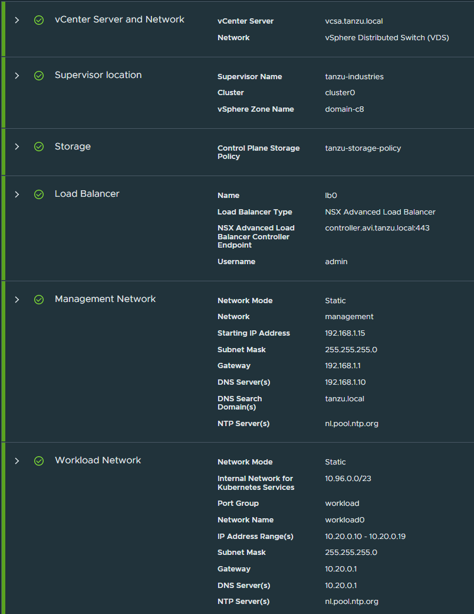
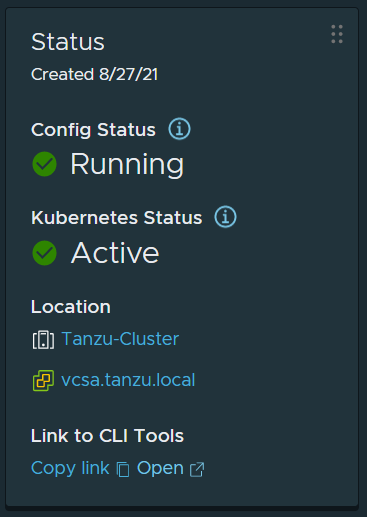

# Enable/Configure `workload management` ( or `tkgs` ) on `vsphere 8`

This document describes how to enable/configure `workload management` ( or `tkgs` ) on `vsphere 8`.

NOTE: If you are looking for instructions on how to install/configure `tkgm`, the *standalone / multicloud* variant of `tkg`, click [here](../tkgm/vsphere).

---

_This is by no means an offical walkthrough and/or ( reference ) documentation and is only intended for experimental installations or workloads. Your mileage will vary. For official documentation see: ( https://docs.vmware.com/en/VMware-vSphere/7.0/vmware-vsphere-with-tanzu/GUID-152BE7D2-E227-4DAA-B527-557B564D9718.html )_

---

### Network
2 static IP addresses are required from your local LAN network.

| Hostname | Address |
| --- |--- |
| router.tanzu.local | 192.168.1.10 |
| haproxy.tanzu.local | 192.168.1.12 |

- 5 IP static IP addresses in a consecutive block ( e.g. 192.168.1.15 - 192.168.1.19 ) will be needed for the Supervisor Control Plane VMs.

The `haproxy` loadbalancer uses the following two _additional_ networks:
- Frontend - `10.10.0/24`
- Workload - `10.20.0.0/24`

---

### Assumptions / Requirements / Prerequisites
- Access to a `vsphere` instance. To setup one, follow [this](../vsphere) guide.
- Access to the required software and licences. For example, through a VMUG Advantage subscription ( https://vmug.com ) or requesting a trial.

---

### Step 1
Download a recent version of a `photon 3.0 ova`. For example, from: https://packages.vmware.com/photon/3.0/Rev3/ova/Update1/photon-hw13_uefi-3.0-913b49438.ova  ( don't use a photon `4.0` ova )

---

### Step 2
Download `ovftool`. For example from:  https://customerconnect.vmware.com/downloads/details?downloadGroup=OVFTOOL441&productId=646

---

### Step 3
Edit `deploy_photon_router_ova.sh` ( or `deploy_photon_router_ova.cmd` ) to meet your local settings ( `network` / `username` / `password` / `location of ova` / etc ).

---

### Step 4
Run `deploy_photon_router_ova.sh` ( or `deploy_photon_router_ova.cmd` ) and wait for the VM to be deployed ( or use `create virtual machine based on ovf` wizard from the esxi web-ui )

---

### Step 5
Login on the router-vm as `root` ( password: `changeme` ) and set photon router root password and note the ip address ( the router vm has now a dhcp address now which will be set to a static ip ( using the `setup_photon_router.sh` script ) ).

---

### Step 6
Edit `setup_photon_router.sh` to meet your local settings ( `hostname` / `network` / etc ).

---

### Step 7
SCP and run the `setup_photon_router.sh` to/on the router ( *run the script from the vm console itself instead of an ssh session because the script will reconfigure the network stack which will result in loss of connection* ).

---

### Step 8
The network of our RouterVM needs to be re-configured so that `eth0` points to the `Management` network and we need to add two additional network adapters: `eth1` for `Frontend` and `eth2` for `Workload` network.

---

### Step 9
Confirm the DNS was configured correctly in the previous step. From a desktop or laptop run:
- `nslookup vmware.com 192.168.1.10`
- `nslookup vcsa.tanzu.local 192.168.1.10`
- `nslookup 192.168.1.11 192.168.1.10`

---

### Step 10
Edit `setup_vcsa_tkgs.ps1` to meet your local settings ( `hostnames` / `network` / `username` / `password` / etc ).

The powershell scripts needs the PowerCLI powershell module ( `Install-Module -Name VMware.PowerCLI` )

Also, run `Set-PowerCLIConfiguration -InvalidCertificateAction Ignore -Confirm:$false` to disable invalid certificate errors.

( when there's no `PowerShell` available, follow the links for intructions on how to do this through the `vSphere client` ( See: https://docs.vmware.com/en/VMware-vSphere/8.0/vsphere-storage/GUID-D025AA68-BF00-4FC2-9C7E-863E5787E743.html )

---

### Step 11
Run `setup_vcsa_tkgs.ps1`

---

### Step 12
Edit `deploy_3nic_haproxy.ps1` to meet your local settings ( `hostnames` / `network` / `username` / `password` / etc ).

This script needs the `haproxy` ova which can be downloaded from the following location: https://cdn.haproxy.com/download/haproxy/vsphere/ova/haproxy-v0.2.0.ova

---

### Step 13
Run `deploy_3nic_haproxy.ps1`

---

### Step 14
SCP `setup_haproxy.sh` to the haproxy vm and execute.

---

### Step 15
At this point, we can verify that all networking is configured correctly by performing the following ping tests from these source/destination systems:

From the RouterVM ping all HAProxy VM interfaces:
- `192.168.1.12`
- `10.10.0.2`
- `10.20.0.2`

From the HAProxy VM ping Router VM Frontend/Workload interfaces:
- `10.10.0.1`
- `10.20.0.1`

From your Desktop, ping HAProxy VM Frontend/Workload interfaces:
- `10.10.0.2`
- `10.20.0.2`

---

### Step 16
Create the required TKG Content Library. Navigate to `Menu -> Content Libraries` and create a new subscribed library with the following URL: https://wp-content.vmware.com/v2/latest/lib.json and ensure content is downloaded immediately ( which is the default ). Call the content library: `TKG-Content-Library` ( it takes approx 10 mins to complete the sync ).

---

### Step 17
In William Lam's blogpost ( https://williamlam.com/2020/11/complete-vsphere-with-tanzu-homelab-with-just-32gb-of-memory.html ) there's a reference to an automated way of enabling workload management. I was never able to get this working, the cluster remained in `Configuring` state and/or the Control Plane Node got the wrong IP. This is most likely a network issue but i was not able to tweak the configuration file ( See: `vsphereWithTanzuParams.ps1` ) enough to get it working.

*IMPORTANT:* To reduce the amount of resources, consider updating `/etc/vmware/wcp/wcpsvc.yaml` *before* running the wizard. This is described later in this document.

Instead, i went the gui/wizard route which worked out-of-the-box for me when i entered the following data.

*Make sure to set `Control Plane Size` to `Tiny`*

It takes approx 30 minutes for the configuration phase to complete.

For reference, below are the parameters when using an `avi` loadbalancer ( for instructions on how to set-up an `avi` loadbalancer, click [here](../avi/vsphere) ).

The Control Plane Node first gets `192.168.1.15` as ip, after approx 15 mins this should change to `10.10.0.65`
When the configuration completes you should see something like this ( *your* controlplane IP might be different from screenshot ):

Upon completion of this step, a VM called `SupervisorControlPlaneVM` is created which acts as a _management_ cluster.

Note:
1) At the beginning of the configuration process there might be messages such as `HTTP communication could not be completed with status 404`. They can be ignored ( they will be retried later in the process and succeed ). This is a description/analisys of the issue ( https://williamlam.com/2020/11/why-am-i-seeing-http-communication-status-404-error-when-configuring-vsphere-with-tanzu-how-to-fix.html ).
2) If the configuration gets stuck with `Cluster domain-c1234 is unhealthy: the server has asked for the client to provide credentials`. Restart the  SupervisorControlPlaneVM vm's ( https://kb.vmware.com/s/article/84448 ).
3) After successfull configuration of workloadmanagement it could happen that, after logout/login to the vcsa console, you run into `None of the hosts connected to this vCenter are licensed for Workload Management.` when navigating to the `Workload Management` screen. This is a known issue and clearing browser cache 'resolves' this problem ( https://williamlam.com/2020/11/quick-tip-rebooting-vcsa-causes-vsphere-with-tanzu-to-show-esxi-hosts-not-licensed-for-workload-management.html ).
4) Copy/Paste the `Server Certificate Authority` certificate from `/etc/haproxy/ca.crt` on the `haproxy` vm

---

### Step 18
To deploy TKG Guest Cluster, you will need to configure a vsphere Namespace and download the `kubectl-vsphere` plugin to your local desktop. Under the `Namespaces` tab within the `Workload Management UI`, select our vsphere with Tanzu Cluster, network `workload0` and provide a name for the namespace `namespace0`. Wait until the namespace is configured properly.

---

### Step 19
After the namespace has been created, click on `Add Permissions` to assign the user administrator@vsphere.local permissions to be able to deploy workloads.

---

### Step 20
Click on `Edit Storage` to assign the VM Storage Policy `Tanzu-Storage-Policy`.

---

### Step 21
Under the `VM Service` within a vsphere Namespace, click on `Manage VM Classes` and then select the `best-effort` ( with 2 and 4 vcpu's ) vm classes.

---

### Step 22
Click on the Open URL under the `Namespace Status` tile to download kubectl and the vsphere plugin and extract that onto your desktop. Add the static routes to the `Control Plane Node` if not already done so. For explanation on _which_ static routes to create and _how_ to create them, look at the end of this document.

Extract the downloaded .zip file and place both files ( `kubectl.exe` and `kubectl-vsphere.exe` ) both in the same directory and this directory should be part of the system path.

---

### Step 23
Try to logon to the `Control Plane Node`

`kubectl vsphere login --server=10.10.0.65 --vsphere-username Administrator@VSPHERE.LOCAL --insecure-skip-tls-verify`

NOTE: If logon fails with an `internal server error` or `bad gateway` error, rebooting the SupervisorControlPlaneVM vm's 'fixed' it for me.

---

### Step 24
If the previous step succeeds, switch to the correct namespace:

`kubectl config use-context namespace0`

Try the following commands `kubectl get namespaces` and `kubectl get nodes`.

---

### Step 25
Download the `tkc.yaml` example which describes our TKG Guest Cluster deployment which will be a single control plane and single worker node. If you chose a different vsphere Namespace (also check version of the distribution), make sure to edit the `tkc.yaml` to reflect those changes. To deploy, run the following command:

`kubectl apply -f tkc.yaml`

This will take some time for both the Control Plane and Worker Node VM deploy, especially since the Worker Node can take a few more minutes after the Control Plane VM has been deployed. Please be patient but it should not take more than 10 minutes. You can monitor the progress using the vsphere UI or you can use kubectl and specify the name of your TKG Guest Cluster and wait until the Phase column shows running.

`kubectl get tanzukubernetescluster tkgs-cluster0`

Wait until `PHASE` indicates `running` ( takes approx 6 mins )

---

### Step 26

Install `nginx` using plain yaml files

To use our TKG Guest Cluster, we need to login and switch into its context by running the following two commands:

`kubectl vsphere login --server=10.10.0.65 -u Administrator@VSPHERE.LOCAL --insecure-skip-tls-verify --tanzu-kubernetes-cluster-name tkgs-cluster0 --tanzu-kubernetes-cluster-namespace namespace0`

`kubectl config use-context tkgs-cluster0`

*One-time action - Apply the `Pod Security Policy` using `tkg-psp.yml`*

`kubectl apply -f tkg-psp.yaml`

Now you are ready to deploy your application to the `tkgs-cluster0` cluster, using `kubectl apply`.

`kubectl get deployments`

`kubectl apply -f nginx-deployment-tkgs.yaml`

Verify if the `nginx-deployment` deployment deployed successfully.

`kubectl get deployments`

`kubectl get services`

`kubectl apply -f nginx-service-tkgs.yaml`

Verify if the `nginx-service` service deployed successfully.

`kubectl get services`

Use `kubectl get deployments`, `kubectl describe deployments`, `kubectl get pods` and/or `kubectl get services` to monitor the progress and get the loadbalanced IP. To view the log of the container use `kubectl logs id` ( get `id` from `kubectl get pods` ).

Open a browser and point it to the external IP ( and port ! ) from the `kubectl get services` command.

If the browser is unable to reach the destination, double-check if the static routes are created.

NOTE:
1) If the deployment fails with `FailedCreate` ( `kubectl describe deployment nginx-deployment` ). Get a more detailed error by running `kubectl describe replicaset nginx-deployment-7848d4b86f` ( where the replicatset id can be taken from the output of the `describe deployment` command ). If the error show in the `describe replicaset` command look like this `Error creating: pods "nginx-deployment-7848d4b86f-" is forbidden: PodSecurityPolicy: unable to admit pod: []`. Then probably the `tkc-psp.yaml` script wasn't applied.
2) If `kubectl apply` commands result in messages such as

`Error from server (workload management cluster uses vsphere Networking, which does not support action on kind Deployment): error when creating "helloworld.yaml": admission webhook "default.validating.license.supervisor.vmware.com" denied the request: workload management cluster uses vsphere Networking, which does not support action on kind Deployment`

This usually means that you are connected to the _Supervisor_ cluster ( the `kubectl login` command looked probably something like this: `kubectl vsphere login --server=10.10.0.65 -u Administrator@VSPHERE.LOCAL --insecure-skip-tls-verify` ).

The `kubectl apply` commands need to be executed against the _TKG_ cluster instead ( the `kubectl login` command should look similar to this: `kubectl vsphere login --server=10.10.0.65 -u Administrator@VSPHERE.LOCAL --insecure-skip-tls-verify --tanzu-kubernetes-cluster-name tkgs-cluster0 --tanzu-kubernetes-cluster-namespace namespace0` ( note the additional `--tanzu-kubernetes-cluster-name` and `--tanzu-kubernetes-cluster-namespace` flags ) )

Use `octant` to view/manage/etc the kubernetes cluster ( See: https://octant.dev )

---

### Optional

---

### Add static route

We need to add a couple of static routes from wherever you plan to connect and deploy your Tanzu Kubernetes Grid (TKG) Guest Clusters. These static routes will allow us to reach both our Frontend ( `10.10.0.0/24` ) and Workload ( `10.20.0.0/24` ) Networks using our RouterVM which have already been pre-created as part of the automation.

On `windows`, open an elevated command prompt and run:

`route add 10.10.0.0 mask 255.255.255.0 192.168.1.10`

`route add 10.20.0.0 mask 255.255.255.0 192.168.1.10`

On `linux`, open a command prompt with a privileged user and run:

`ip route add 10.10.0.0/24 via 192.168.1.10 dev eth0`

`ip route add 10.20.0.0/24 via 192.168.1.10 dev eth0`

To verify that everything is working, you should now be able to successfully ping both `10.10.0.1` and `10.20.0.1` which are the respective gateways for each of our private networks.

---

### Update `/etc/vmware/wcp/wcpsvc.yaml`

SSH into the vcsa VM and update `/etc/vmware/wcp/wcpsvc.yaml` accordingly:
- Set `minmasters` and `maxmasters` to `1`.
- `logging_fluentbit_enabled: false`
- under `logging` set `level` to `info`
- `controlplane_vm_disk_provisioning: "thin"`

*As of vsphere 7.0 Update 3, you can now have just a single Supervisor Control Plane VM*

Restart wcpsvc using `service-control --restart wcp`

NOTE:
- For reference, a sample `/etc/vmware/wcp/wcpsvc.yaml` is included in this repo.
- After a vsphere update, chances are the changes in `/etc/vmware/wcp/wcpsvc.yaml` are undone. The following guide describes how to scale back to two instances https://patrik.kernstock.net/2021/06/downscaling-supervisorcontrolplanevms-from-three-to-two-nodes/

---

### Login through SSH on `SupervisorControlPlaneVM` vm's
_This is for debugging purposes only!_

_DNS/Network related issues can and should always be solved in a proper way by configuring the correct network parameters during configuration of the workload management part this section is for debugging purposes only!_

In case commands such as `kubectl vpshere login` take a while to complete ( approx 45 seconds ) there's probably a dns issue on the supervisor control plane VM's. The supervisor control plane VM need to be able to resolve the fqdn of the vcsa ( in this example `vcsa.tanzu.local` ). If this is not the case you will see several ( probably 3 ) 15 secs delays during the `kubectl vpshere login` commands ( add flag `-v=9` for more verbose output of the `kubectl vpshere login` command )

To help debug this, you can SSH into the supervisor control plane VM's ( for example, to update `/etc/hosts` on _all_ supervisor control plane VM's ) as follows:

SSH into the vCenter VM and run `/usr/lib/vmware-wcp/decryptK8Pwd.py `

`root@vcsa-01a [ ~ ]# /usr/lib/vmware-wcp/decryptK8Pwd.py`

`Read key from file`

`Connected to PSQL`

`Cluster: domain-c8:ac691e20-bbff-481f-a67c-3b85d0b5a1d5i`

`IP: 192.168.1.11`

`PWD: PgfFTPFtW/3FEfyqGuyVPYOJQMwNhOq21t2WiPijbH4BTrkHVgJqJpRETXaoZlchRZ20hGxWtGXKVMwFR4YWJ6Bh5i8L9Do9nkzJG9AlKlwwR24WbqTfaoDUM8kNLhxE1hIPzQoDgL7oQkSRnJRcBz+UPvd82Jc8buR9nsceMbg=`

`root@vcsa-01a [ ~ ]#`

Next, SSH into a SupervisorControlPlaneVM vm as user `root` with the password retrieved in de the previous step ( the `PWD` string ). Open `/etc/hosts` and add `192.168.1.11 vcsa.tanzu.local`. 

Repeat this for _all_ SupervisorControlPlaneVM vm's.

The update of the hosts file is effective immediately, no reboot or needed.

The `kubectl vpshere login` should now complete in a few seconds instead of approx 45 sec.

( see: https://kb.vmware.com/s/article/83060 )

---

### Login through SSH to the `control-plane` and `worker` nodes
_This is for debugging purposes only!_

_DNS/Network related issues can and should always be solved in a proper way by configuring the correct network parameters during configuration of the workload management part this section is for debugging purposes only!_

In case deployments of workloads get stuck in a `ErrImagePull` pod status, there's probably a `network` and/or `dns` configuration issue on the `control-plane` and/or `worker` nodes. To help debug this, you can SSH ( from a linux jumphost or the vcsa shell ) to a Tanzu Kubernetes cluster node as the `vmware-system-user` using a password.

You can connect to a cluster node as the vmware-system-user user with a password. The password is stored as a secret named `CLUSTER-NAME-ssh-password`. The password is base64 encoded in `.data.ssh-passwordkey`. You can provide the password over an SSH session.

Logon to the supervisor cluster `kubectl vsphere login --server=10.10.0.65 -u Administrator@VSPHERE.LOCAL --insecure-skip-tls-verify`

Switch context to the vsphere Namespace where the target Tanzu Kubernetes cluster is provisioned

`kubectl config use-context namespace0`

List the nodes.

`kubectl get virtualmachines`

Describe the nodes to get the IP address of the target node.

`kubectl describe virtualmachines`

View the `TKGS-CLUSTER-NAME-ssh-password` secret.

`kubectl get secrets`

Get the ssh-passwordkey for the target cluster.

`kubectl get secrets TKGS-CLUSTER-NAME-ssh-password -o yaml`

The ssh-passwordkey is returned, for example.

`apiVersion: v1`

`data:`

`ssh-passwordkey: RU1pQllLTC9TRjVFV0RBcCtmd1zwOTROeURYSWNGeXNReXJhaXRBUllYaz0=`

Decode the ssh-passwordkey.

The secret is Base64 encoded. To decode it:

`echo <ssh-passwordkey> | base64 --decode`

SSH to the target cluster node as the `vmware-system-user`.

`ssh vmware-system-user@TKGS-CLUSTER-NODE-IP-ADDRESS`

Log in using the password you decoded.

---

### Install `harbor` using Helm
Enabling the embedded Harbor docker registry in Tanzu requires an NSX-T setup, which takes approx. 80GB memory which does not work in a homelab setup with 64GB memory. Installing Harbor on one of the worker nodes can be done as follows.

- Install `helm` ( https://helm.sh )
- Add the `Bitnami Harbor` repository ( there's also an `Official Harbor Helm` repository ( https://helm.goharbor.io ) which i could not get working )

`helm repo add bitnami https://charts.bitnami.com/bitnami`

`helm repo update`

- The Tanzu Kubernetes Grid Service does not provide default `RoleBinding` and `ClusterRoleBinding` for Tanzu Kubernetes clusters. Thus we have to apply a `Pod Security Policy` (PSP) to our TKG cluster.

Apply the `Pod Security Policy` using `tkg-psp.yml`

`kubectl apply -f tkg-psp.yml`

- Create a namespace called `harbor`

`kubectl create ns harbor`

- Install `harbor`

`helm install harbor bitnami/harbor --set harborAdminPassword='topSecretPassword' --set global.storageClass=tanzu-storage-policy --set service.type=LoadBalancer --set externalURL=harbor.tanzu.local --set service.tls.commonName=harbor.tanzu.local -n harbor`

Monitor the deployment progress by watching ( `watch -n 1 ` ) the command `kubectl get deployment -n harbor`. By running `kubectl get pods -n harbor` you should see how every single Pod will pop-up one by one and will end up in the status RUNNING. Next, `kubectl get svc -n harbor` will give you the assigned external IP address through which you can access the Harbor Login page.

( See: https://rguske.github.io/post/vsphere-7-with-kubernetes-supercharged-helm-harbor-tkg/ and https://rguske.github.io/post/vsphere-with-tanzu-troubleshooting-haproxy/ )

---

### Install `gitlab` using Helm
This install assumes the cluster supports service `LoadBalancer`. If your cluster doesn't support service `LoadBalancer`, install a loadbalancer such as `metallb` ( or an external `ha-proxy` in case of deployment on `tkgs` ).

- Install `helm` ( https://helm.sh )
- Add the `gitlab` repository 

`helm repo add gitlab https://charts.gitlab.io/`

`helm repo update`

- Install `gitlab`

`helm install gitlab gitlab/gitlab --set certmanager.install=false --set global.ingress.configureCertmanager=false --set global.hosts.domain=tanzu.local --set gitlab-runner.install=false --set registry.enabled=false`

- Find out on which IP the services are running

`kubectl get ingress -lrelease=gitlab`

- Get the initial password for user `root`

`kubectl get secret gitlab-gitlab-initial-root-password -ojsonpath='{.data.password}' | base64 --decode ; echo`

---
