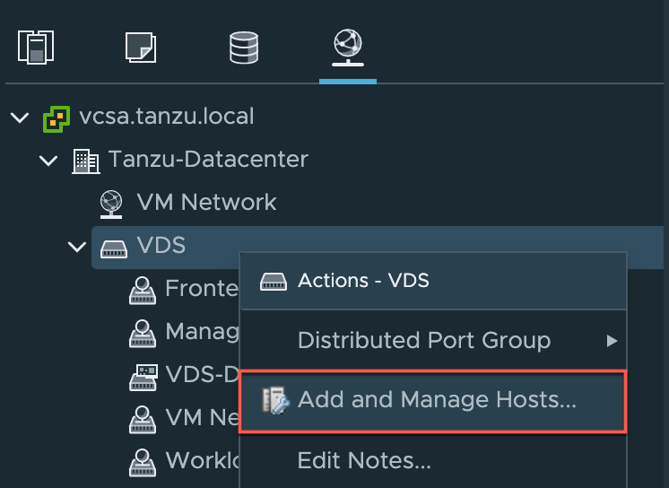
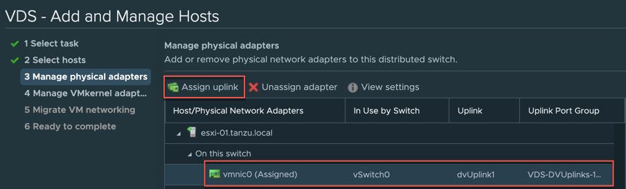
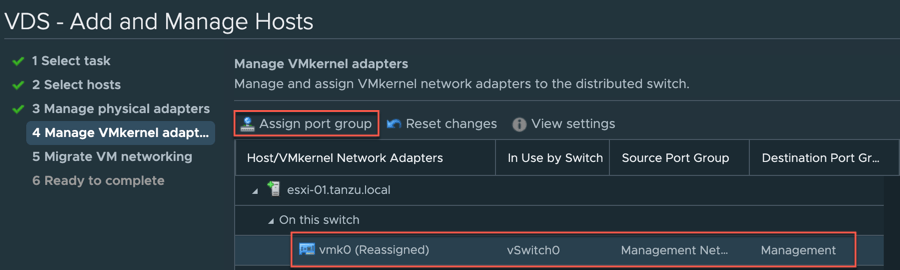
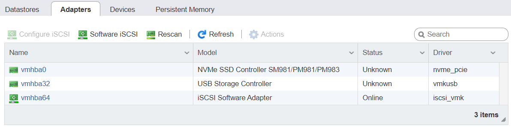
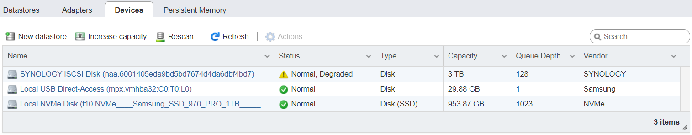
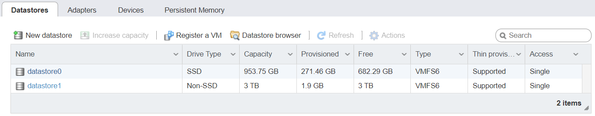
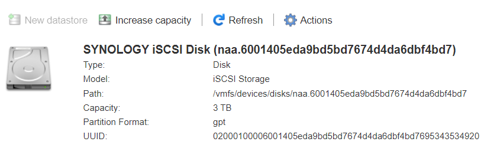
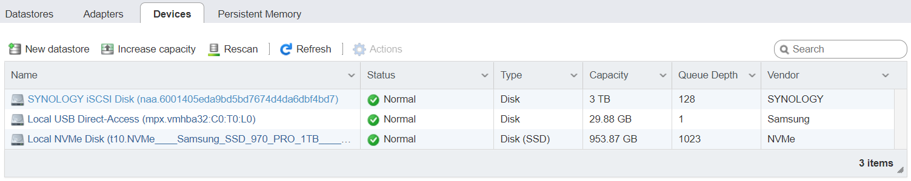

# Install/Configure `esxi 7` and `vsphere 7`

This document describes the setup of a vmware homelab and is heavily inspired on William Lam's guide to installing a Tanzu homelab ( https://williamlam.com/2020/11/complete-vsphere-with-tanzu-homelab-with-just-32gb-of-memory.html ) and is adjusted mainly to accomodate my local network setup.

---

_This is by no means an offical walkthrough and/or ( reference ) documentation and is only intended for experimental installations or workloads. Your mileage will vary. For official documentation see: ( https://docs.vmware.com/en/VMware-vSphere/ )_

---

### Network
3 static IP addresses are required from your local LAN network.

| Hostname | Address |
| --- |--- |
| esxi01.tanzu.local | 192.168.1.2 |
| esxi02.tanzu.local | 192.168.1.3 |
| vcsa.tanzu.local | 192.168.1.11 |

---

### Assumptions / Requirements / Prerequisites
- A system with no OS installed and no partitions defined on the SSD. If there are OS/partitions on the SSD, wipe all partitions from ssd and esxi boot device ( for example, using a fedora live usb ) prior to starting this guide ( Reminder for `NUC`: `f2 -> bios / f10 -> select boot device` ).
- Access to the required software and licenses. For example, through a VMUG Advantage subscription ( https://vmug.com ) or requesting a trial.
- A customerconnect account ( to download some additional tools ( https://customerconnect.vmware.com ) ).

---

### Step 1
Prepare a USB stick and load the `esxi` install iso ( `VMware-VMvisor-Installer-7.0U3d-19482537.x86_64.iso` ) on it ( for example, by using a tool like `Rufus` ( https://rufus.ie ) ).

---

### Step 2
Boot from `esxi` usb device and perform a `next -> next -> next -> finish` install accepting all the defaults ( avoid using # in the root password. For example, at the time of writing this document, the `ovftool` tool could not handle those kind of characters in passwords ( _ and ! appear to be fine ) ).

---

### Step 3
After reboot, on the `esxi` console ( connect a monitor to the NUC ), using the F2 key, set fixed ip ( `192.168.1.2` or `192.168.1.3` or `192.168.1.4` ) and hostname ( `esxi01` or `esxi02` or `esxi03` ) and disable `ipv6`. 

Reboot to activate the changes.

---

### Step 4
Start service `ssh` and set the policy to `start and stop with host` ( under `host -> manage -> services` ).

---

### Step 5
Configure ntp ( `under host -> manage -> system -> date/time` ). Use server `nl.pool.ntp.org`. Set policy to `start and stop with host`.

---

### Step 6
Start service `ntpd` ( under `host -> manage -> services` ).

---

### Step 7
Update `esxi` to latest ( at the time of writing this `7.0u3e` was the latest version ) version ( if no iso avail, use: `esxcli software profile update -p ESXi-7.0U3e-19898904-standard -d https://hostupdate.vmware.com/software/VUM/PRODUCTION/main/vmw-depot-index.xml` ( see: https://tinkertry.com/easy-update-to-latest-esxi ) )

---

### Step 8
Reboot the `esxi` host.

---

### Step 9
On a laptop or workstation, mount the `vcsa` virtual applicance iso ( `VMware-VCSA-all-7.0.3-19717403.iso` ).

---

### Step 10
Edit `vcsa.tanzu.local.json` to meet your local settings ( `hostname` / `network` / `username` / `password` / `datastore` / etc ).

---

### Step 11
Run ( from: `d:\vcsa-cli-installer\win32` or `/path/to/mountpoint/vcsa-cli-installer/lin64` ) `vcsa-deploy.exe install --accept-eula --no-ssl-certificate-verification c:\path\to\vcsa.tanzu.local.json` ( or `./vcsa-deploy install --accept-eula --no-ssl-certificate-verification /path/to/vcsa.tanzu.local.json` ) this operation takes approx 20 mins to complete.

---

### Step 12
Login on the `vCenter` console ( `https://vcsa.tanzu.local/ui` ) and add the `vCenter` and `vsphere` licenses ( `administration -> licensing -> licenses` ). Under `assets` assign the proper licenses to the appropriate assets.

---

### Step 13
Update vCenter to latest version ( open mgmt portal ( port: `5480` ) see `Updates` ).

---

### Step 14
Edit `setup_vcsa_vanilla.ps1` to meet your local settings ( `hostname` / `network` / `username` / `password` / etc ). 

The powershell scripts needs the PowerCLI powershell module ( `Install-Module -Name VMware.PowerCLI -AllowClobber -Force -Confirm:$false` )

Also, run `Set-PowerCLIConfiguration -InvalidCertificateAction Ignore -Confirm:$false` to disable invalid certificate errors.

---

### Step 15
Run `setup_vcsa_vanilla.ps1`

---

### Step 16
Navigate to the `Networking` view in the vsphere UI and right click on the VDS and select `Add and Manage Hosts` option.

Select `Add Hosts` and then add our `esxi` host using the "+" icon and click `Next`.

On the physical adapters, select `vmnic0` and then click on `Assign uplink` icon at the top of the menu ( `Auto-Assign` ).

On the `VMkernel adapters`, select `vmk0` and then click on `Assign port group` icon at the top of the menu.

We will skip Migrate VM networking as that will be done in the `esxi` Embedded Host Client and then click finish to perform the migration from the Virtual Standard Switch (VSS) to VDS.

_It is expected that the VCSA is no longer accessible after you click finish, this is because our VCSA networking has not been updated to point to the new VDS port group which is connected to our NIC._

---

### Step 17
Login to `esxi`, edit the VCSA VM and change the network adapter to now point to our `Management` port group.

After making the change, you should now be able to refresh the vsphere UI and VCSA should now respond again.

---

### Step 18
Logon to `esxi` console and navigate to `Networking` -> `Port groups`.
Check if there are no VM's connected to the `VM Network` portgroup.
Delete portgroup `VM Network` ( under `Actions` ).

Navigate to `Networking` -> `Virtual switches` -> `vSwitch0`.
Delete virtual switch `vSwitch0` ( under `Actions` ).

---

### Step 19
Reboot the `esxi` host.

---

### Optional 

---

### Add iSCSI storage
Open the esxi console and go to `Storage -> Adapters -> Software iSCSI`. Click on the radio button to enable iSCSI. After a few seconds the rest of the form shows up. Under `CHAP authentication`, select `Use CHAP` and enter username/password.

Under `Network port bindings` select VMkernel NIC `vmk0`.

Under `Static targets` add new target by it's `iqn` and `address`.

After refresh the `iSCSI Software Adapter` should appear.

Under devices the synology iSCSI device should appear with status `Normal, Degraded` ( we will address the status later )

If there's an existing datastore it should appear after re-scan, otherwise create a new one.

If there is only one path to the target then the status is `Normal, Degraded`. This does not have any effect on the functioning of the LUN. Because this is counted as remote disk it expects two paths to it, if not found it will put it as degraded. 

First, get the iSCSI disk ID. Go to `Storage -> Devices -> ( click on the iSCSI device )`

In this example, the disk id is: `naa.6001405eda9bd5bd7674d4da6dbf4bd7`.

Next, we need to tag this as local disk using the following procedure through SSH ( on the esxi host ).

`esxcli storage nmp satp rule add -s VMW_SATP_LOCAL --device diskid --option="enable_local"` ( replace `diskid` with the disk identifier )

`esxcli storage core claiming reclaim -d diskid` ( replace `diskid` with the disk identifier )

`esxcli storage core claimrule load`

`esxcli storage core claimrule run`

Now the datastore has status `Normal`

( source: https://communities.vmware.com/t5/ESXi-Discussions/Disks-degraded-in-ESXi/m-p/1404465#M134443 )

Note:
- _If_ the iSCSI datastore disappears after reboot, add it back by navigating to `Storage -> Adapters -> ( select the iscsi adapter ) -> Configure iSCSI` and re-add the target iqn and address under `Static targets` and save the configuration. Now, the iSCSI datastore should re-appear.

---

